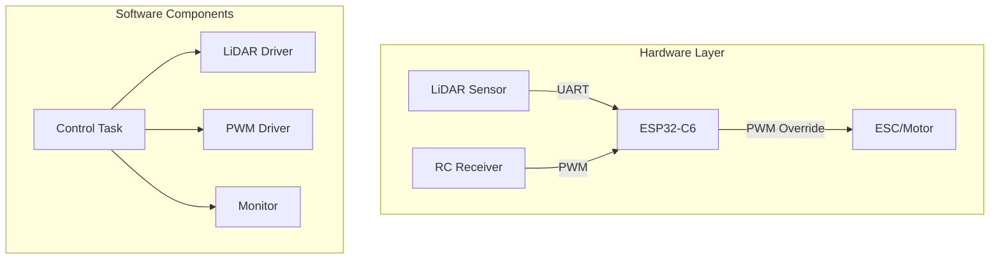

# 🚀 ESP32-C6 DigiToys ADAS Firmware

<!-- vscode-markdown-toc -->

- [📦 Prerequisites](#Prerequisites)
- [🧭 First-Time Setup (One-Time per Machine)](#First-TimeSetupOne-TimeperMachine)
- [🛠️ Working with the ESP-IDF Extension](#WorkingwiththeESP-IDFExtension)
  - [🧱 Build the Project](#BuildtheProject)
  - [🔥 Flash the Firmware to the ESP32-C6 (JTAG)](#FlashtheFirmwaretotheESP32-C6JTAG)
  - [📟 Monitor Serial Output](#MonitorSerialOutput)
  - [🐞 Start Debugging (JTAG)](#StartDebuggingJTAG)
- [🔄 Reopening the Dev Container](#ReopeningtheDevContainer)
- [✅ What's Preconfigured](#WhatsPreconfigured)
- [🏗️ Architecture Overview](#ArchitectureOverview)
- [📦 Components](#Components)
- [⚙️ FreeRTOS Tasks](#FreeRTOSTasks)
- [📁 Development Guide](#DevelopmentGuide)
  - [📁 Create a New Component Folder](#CreateaNewComponentFolder)
  - [✍️ Implement the Component](#ImplementtheComponent)
  - [⚙️ Add a `CMakeLists.txt` for the Component](#AddaCMakeLists.txtfortheComponent)
  - [📦 Add the Component to the Project](#AddtheComponenttotheProject)
  - [🧪 Use the Component in Your Application](#UsetheComponentinYourApplication)
  - [🔄 Reconfigure & Build](#ReconfigureBuild)

<!-- vscode-markdown-toc-config
	numbering=false
	autoSave=true
	/vscode-markdown-toc-config -->
<!-- /vscode-markdown-toc -->

This project implements **Autonomous Emergency Braking (AEB)** for RC vehicles using **ESP32-C6** and **LiDAR sensor technology**. The firmware provides ADAS-like safety features including obstacle detection, dynamic braking thresholds, and emergency intervention while maintaining normal RC vehicle operation.

This project uses **Visual Studio Code Dev Containers** and the **ESP-IDF extension** to provide a fully isolated, reproducible development environment for ESP32-C6 firmware development — without polluting your host system.

Everything (toolchain, Python, OpenOCD, and IDF) is preinstalled in a Docker container that launches automatically through VSCode.

## <a name='Prerequisites'></a>📦 Prerequisites

Make sure the following are installed on your machine:

| Tool                         | Link                                                                                   |
| ---------------------------- | -------------------------------------------------------------------------------------- |
| **Visual Studio Code**       | https://code.visualstudio.com/                                                         |
| **Docker Desktop / Engine**  | https://www.docker.com/products/docker-desktop                                         |
| **Dev Containers Extension** | https://marketplace.visualstudio.com/items?itemName=ms-vscode-remote.remote-containers |

## <a name='First-TimeSetupOne-TimeperMachine'></a>🧭 First-Time Setup (One-Time per Machine)

1. **Clone this project**:

   ```bash
   git clone https://github.com/Nowass/digitoys-firmware
   cd digitoys-firmware
   ```

2. **Open the folder in VSCode**:

   ```bash
   code .
   ```

3. **When prompted**, choose:

   > `Reopen in Container`

   Or manually via Command Palette:
   `F1` → `Dev Containers: Reopen in Container`

   > In case the docker permission is missing from the current user run the following:
   ```bash
   sudo usermod -aG docker $USER
   sudo reboot
   ```

4. **Wait for the container to build** (🚀 _First time may take a few minutes_)

   - Tools will be downloaded
   - Python environment + ESP-IDF will be initialized
   - This only happens **once** — future starts are fast

## <a name='WorkingwiththeESP-IDFExtension'></a>🛠️ Working with the ESP-IDF Extension

Once the Dev Container loads, the **ESP-IDF extension** is already installed and configured.

Use the **VSCode status bar and Command Palette (`F1`)** to access the most common operations:

### <a name='BuildtheProject'></a>🧱 Build the Project

- 📥 Click the **"Build"** button in the **status bar**
  or
- Press `F1` → type `ESP-IDF: Build your project`

This runs `idf.py build` behind the scenes and compiles your firmware.

### <a name='FlashtheFirmwaretotheESP32-C6JTAG'></a>🔥 Flash the Firmware to the ESP32-C6 (JTAG)

- 🔌 Connect your board to USB/JTAG
- 📦 Click **"Flash"** in the status bar
  or
- Press `F1` → `ESP-IDF: Flash your project`

> 💡 Choose `YES` to start the OpenOCD server if not running.

> 💡 The default serial port is usually `/dev/ttyUSB0` on Linux.

### <a name='MonitorSerialOutput'></a>📟 Monitor Serial Output

After flashing, open the serial monitor:

- Press `F1` → `ESP-IDF: Monitor your device`

> You can also combine **flash + monitor** using:
> `ESP-IDF: Flash (with monitor)`

By default, this project assumes your device appears as:

```json
"idf.port": "/dev/ttyUSB0"
```

> 🐧 **Linux users:** this is usually correct
> 🪟 **Windows users:** change this to e.g. `"COM3", "COM4", etc.`

To change it:

1. Open `.vscode/settings.json`
2. Update the `idf.port` value to match your platform and device

### <a name='StartDebuggingJTAG'></a>🐞 Start Debugging (JTAG)

1. Connect the board to USB/JTAG debugger
2. Press `F5` or go to the **Run and Debug** panel
3. Select the **"Launch"** debug configuration

## <a name='ReopeningtheDevContainer'></a>🔄 Reopening the Dev Container

If you ever want to reopen the project in the container after closing:

- `F1` → `Dev Containers: Reopen in Container`

To exit back to host:

- `F1` → `Dev Containers: Reopen Folder Locally`

## <a name='WhatsPreconfigured'></a>✅ What's Preconfigured

- ESP-IDF v6.0 toolchain for ESP32-C6
- Python virtual environment with all required packages
- OpenOCD for JTAG/debugging
- JTAG flash tool
- Serial monitor
- Fully isolated and reproducible development environment

## <a name='ArchitectureOverview'></a>🏗️ Architecture Overview

The DigiToys firmware implements an **Autonomous Emergency Braking (AEB)** system with the following key features:

- **Real-time obstacle detection** using LiDAR sensor (LD19 360° LiDAR)
- **RC signal passthrough** with emergency override capability
- **Dynamic safety thresholds** based on vehicle speed
- **Progressive intervention**: Warning → Slowdown → Emergency brake
- **Web-based monitoring** dashboard for telemetry and diagnostics

### System Components



👉 **[See detailed architecture documentation](./doc/architecture-overview.md)**

## <a name='Components'></a>📦 Components

| Component | Purpose | Documentation |
|-----------|---------|---------------|
| **control-task** | Main control logic and safety algorithms | [📖 Details](./doc/control-task.md) |
| **lidar-driver** | LiDAR sensor interface and data processing | [📖 Details](./doc/lidar-driver.md) |
| **adas-pwm-driver** | PWM signal capture and brake override | [📖 Details](./doc/adas-pwm-driver.md) |
| **monitor** | System telemetry and web dashboard | [📖 Details](./doc/monitor.md) |
| **digitoys-core** | Infrastructure framework and centralized logging | [📖 Details](./doc/centralized-logging.md) |

👉 **[See complete component overview](./doc/component-details.md)**

## <a name='FreeRTOSTasks'></a>⚙️ FreeRTOS Tasks

The firmware uses a multi-task architecture optimized for real-time safety control:

| Task | Priority | Stack | Period | Purpose |
|------|----------|-------|--------|---------|
| **ControlTask** | IDLE+2 | 8KB | 50ms | Main safety control logic |
| **lidar_task** | IDLE+1 | 4KB | 10ms | LiDAR data processing |
| **rmt_in_task** | IDLE+1 | 4KB | Event | PWM input capture |
| **httpd** | IDLE+1 | 4KB | Event | Web server monitoring |

- **Control Loop Frequency**: 20Hz (50ms cycle time)
- **Brake Response Time**: <100ms from obstacle detection
- **CPU Utilization**: ~25% under normal operation

👉 **[See detailed task architecture documentation](./doc/freertos-task-architecture.md)**

## 📋 Centralized Logging System

The firmware includes a **production-ready centralized logging system** that provides unified logging management across all components with a simplified API:

### Key Features
- **Simplified 2-parameter macros**: No redundant tag specification
- **Automatic component registration**: Register once, use everywhere
- **Runtime log level control**: Per-component debugging without rebuilding
- **Complete component coverage**: All 6 major components migrated

### Usage Example
```cpp
// Register component once during initialization
DIGITOYS_REGISTER_COMPONENT("MyComponent", "MY_TAG");

// Use clean 2-parameter logging everywhere
DIGITOYS_LOGI("MyComponent", "Operation completed successfully");
DIGITOYS_LOGW("MyComponent", "Warning: value %.2f out of range", value);
DIGITOYS_LOGE("MyComponent", "Failed with error: %d", error_code);

// Runtime control
auto& logger = digitoys::core::Logger::getInstance();
logger.setComponentLogLevel("MyComponent", ESP_LOG_DEBUG);
```

👉 **[See complete logging documentation](./doc/centralized-logging.md)**

## <a name='DevelopmentGuide'></a>📁 Development Guide

This project supports modular C++ development using **ESP-IDF components**. Components allow you to organize features or libraries (e.g. drivers, logic blocks) into reusable units.

### <a name='CreateaNewComponentFolder'></a>📁 Create a New Component Folder

Inside the project root, create the folder `components/my_component`:

```bash
mkdir -p components/my_component
```

**Folder Structure:**

```
components/
└── my_component/
    ├── MyComponent.cpp
    ├── MyComponent.hpp
    └── CMakeLists.txt
```

### <a name='ImplementtheComponent'></a>✍️ Implement the Component

**Example: `MyComponent.hpp`**

```cpp
#pragma once
#include <string>

class MyComponent {
public:
    MyComponent(const std::string& name);
    void do_something();
private:
    std::string name_;
};
```

**Example: `MyComponent.cpp`**

```cpp
#include "MyComponent.hpp"
#include <Logger.hpp>

MyComponent::MyComponent(const std::string& name) : name_(name) {
    // Register with centralized logging system
    DIGITOYS_REGISTER_COMPONENT("MyComponent", "MY_TAG");
    
    DIGITOYS_LOGI("MyComponent", "Component '%s' initialized", name_.c_str());
}

void MyComponent::do_something() {
    DIGITOYS_LOGI("MyComponent", "Component '%s' is doing something!", name_.c_str());
    
    // Example of debug logging
    DIGITOYS_LOGD("MyComponent", "Debug info: processing operation");
    
    // Example of error logging  
    if (some_error_condition) {
        DIGITOYS_LOGE("MyComponent", "Operation failed with error code: %d", error);
    }
}
```

### <a name='AddaCMakeLists.txtfortheComponent'></a>⚙️ Add a `CMakeLists.txt` for the Component

**`components/my_component/CMakeLists.txt`**

```cmake
idf_component_register(SRCS "MyComponent.cpp"
                       INCLUDE_DIRS "."
                       REQUIRES "digitoys-core")
```

> This tells ESP-IDF which sources and headers to compile and which other components this one needs. The `digitoys-core` requirement gives you access to the centralized logging system.

### <a name='AddtheComponenttotheProject'></a>📦 Add the Component to the Project

Edit the **root** `CMakeLists.txt` (if the component isn't auto-detected):

```cmake
set(EXTRA_COMPONENT_DIRS
    ${CMAKE_CURRENT_SOURCE_DIR}/components
    ${CMAKE_CURRENT_SOURCE_DIR}/components/my_component
)
```

> **Often this is not needed** — ESP-IDF automatically finds components in the `components/` folder.

### <a name='UsetheComponentinYourApplication'></a>🧪 Use the Component in Your Application

**In `main/main.cpp`:**

```cpp
#include "MyComponent.hpp"

extern "C" void app_main() {
    MyComponent::do_something();
}
```

> Don't forget to add `my_component` to the `REQUIRES` list in `main/CMakeLists.txt`:

```cmake
idf_component_register(SRCS "main.cpp"
                       INCLUDE_DIRS "."
                       REQUIRES "my_component")
```

### <a name='ReconfigureBuild'></a>🔄 Reconfigure & Build

1. **Clean & reconfigure**:
   - `F1` → `ESP-IDF: Full clean`
   - `F1` → `ESP-IDF: Build your project`

2. **Flash and test**:
   - `F1` → `ESP-IDF: Flash your project`

---

## 📚 Complete Documentation

For comprehensive system documentation, see:

- **[📖 Documentation Index](./doc/README.md)** - Complete documentation overview
- **[🏗️ Architecture Details](./doc/architecture-overview.md)** - System design and data flow
- **[⚙️ Task Architecture](./doc/freertos-task-architecture.md)** - FreeRTOS task details
- **[🛡️ Safety & Control Logic](./doc/safety-and-control-logic.md)** - Safety mechanisms
- **[⏱️ Performance Analysis](./doc/timing-and-performance.md)** - Timing and optimization

Happy hacking! ✨

_Powered by ESP-IDF, VSCode, and Dev Containers 🐳_
