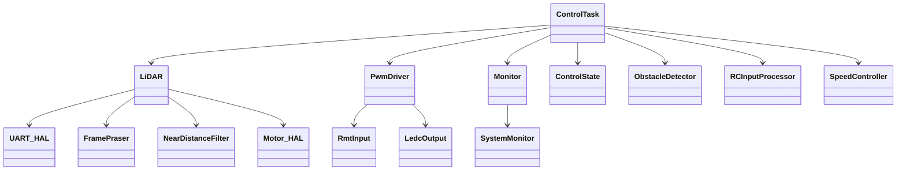
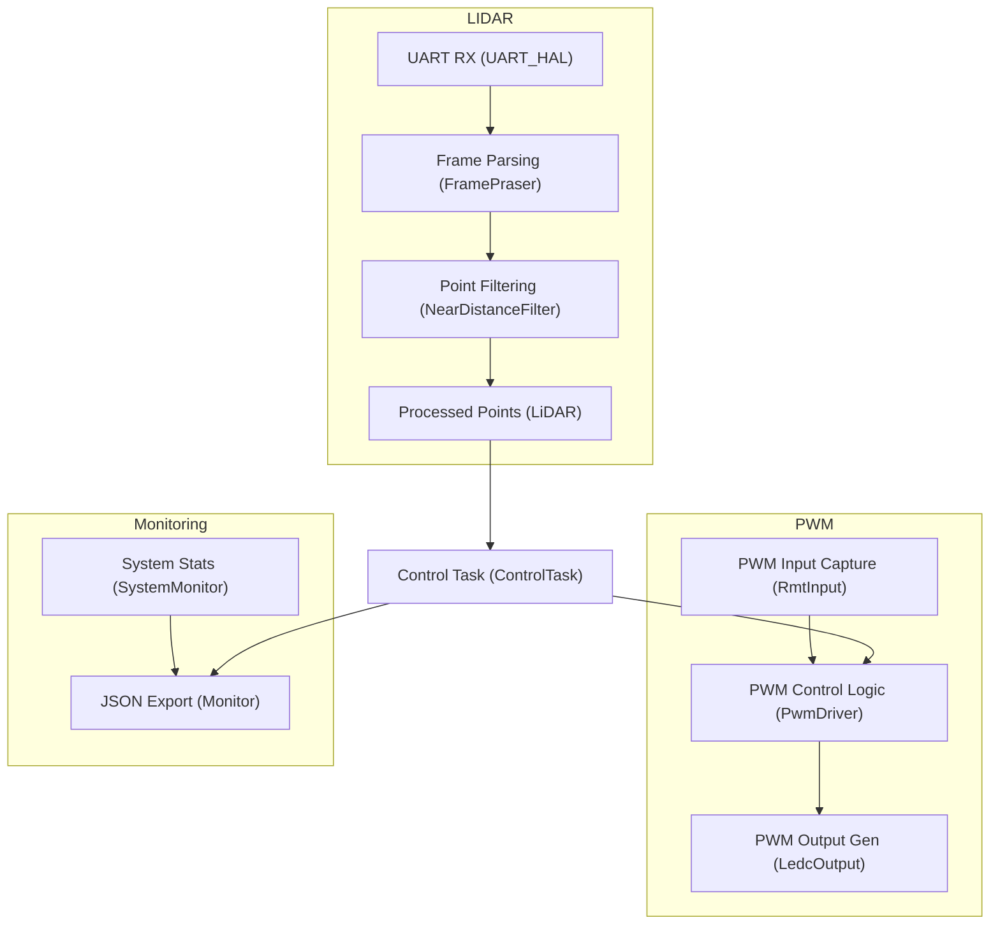

# 🚗 DigiToys Firmware Overview

This firmware powers a smart RC car platform equipped with ADAS-like functionality using LiDAR sensors and PWM-controlled actuators. It is modular, built on top of ESP-IDF, and structured for clarity, portability, and expandability.

## 📐 Architecture Overview

The DigiToys firmware is structured around a real-time control task that orchestrates LiDAR-based obstacle detection and PWM-based motion control.

At the core is the **`ControlTask`**, running on FreeRTOS, which continuously:

- Reads point cloud data from the LiDAR sensor
- Filters out near-noise using a configurable threshold
- Decides whether to override throttle signal based on obstacle proximity
- Logs system metrics for diagnostic purposes

The software architecture is composed of the following modules:

- **`control-task`**: Main control logic orchestrator implementing ADAS-like safety algorithms, state management, and decision making.
- **`lidar-driver`**: Handles UART-based LiDAR communication, frame parsing, filtering, and motor control.
- **`adas-pwm-driver`**: Manages bidirectional PWM signals, allowing passthrough from RC receiver or override by safety logic.
- **`monitor`**: Extracts heap, CPU, and task metrics and serializes them to JSON for web-based dashboards.
- **`bmi270-driver`**: Accelerometer driver (currently unused, available for future motion sensing features).

All components are linked via a shared context (`ControlContext`) and orchestrated by the `ControlTask`.

## 🧠 Functional Flow

The entire application is orchestrated by a real-time `ControlTask`, which reads LiDAR data, evaluates obstacle distance, and adjusts the output PWM signal accordingly.

## 🧩 Component Responsibilities

### 🟢 lidar-driver

| Class              | Responsibility |
|--------------------|----------------|
| `LiDAR`            | Central LiDAR interface. Used by `ControlTask` to access filtered point data. |
| `FramePraser`      | Parses UART stream into LiDAR frames. |
| `LiDARConfig`      | Configuration (UART, filtering thresholds). |
| `UART_HAL`         | Initializes UART and provides buffered RX. |
| `Motor_HAL`        | Controls LiDAR motor power. |
| `NearDistanceFilter` | Filters out nearby noise. |
| `PointData`        | Represents individual scan points. |

### 🟡 adas-pwm-driver

| Class                 | Responsibility |
|-----------------------|----------------|
| `IPwmChannel`         | Abstract PWM interface. |
| `RmtInput`            | Captures PWM input (from RC receiver). |
| `LedcOutput`          | Outputs PWM (to motor/servo). |
| `PwmPassthroughChannel` | Copies input directly to output. |
| `PwmDriver`           | Manages channels and override logic based on obstacle data. |

### 🔵 monitor

| Class            | Responsibility |
|------------------|----------------|
| `SystemMonitor`  | Reads FreeRTOS stats: heap, CPU, tasks. |
| `Monitor`        | Serializes monitor data to JSON (dashboard export). |

👉 [See the component details](./../doc/component-details.md)

## 🚦 Runtime Behavior Summary

1. **ControlTask** (in `main.cpp`):
   - Orchestrates the main control loop at 50ms intervals
   - Reads data from `LiDAR` for obstacle detection
   - Processes RC input via `PwmDriver` for vehicle state
   - Implements sophisticated safety algorithms with dynamic thresholds
   - Overrides throttle PWM using `PwmDriver` when obstacles detected
   - Feeds runtime metrics to `Monitor` for telemetry
   - Manages system state transitions and safety logic

2. **LiDAR Subsystem**:
   - Continuously captures and filters obstacle data at 10ms intervals
   - Provides structured point cloud with distance and angle information
   - Implements configurable filtering for noise reduction

3. **PWM Subsystem**:
   - Captures RC signals in real-time using RMT hardware
   - Passes RC signal through normally or overrides with brake signal
   - Supports both throttle and steering channels (currently throttle only)

4. **Control Subsystem**:
   - Implements state machine with multiple safety states
   - Calculates speed-dependent braking and warning distances
   - Provides progressive intervention: warning → slowdown → emergency brake
   - Allows full reverse motion with safety states cleared

5. **Monitoring Subsystem**:
   - Publishes internal health and metrics to web dashboard
   - Provides real-time telemetry for debugging and analysis
   - Tracks system performance and resource utilization

## 🏗️ FreeRTOS Task Architecture

The firmware uses a multi-task architecture with the following task hierarchy:

| Task | Priority | Stack | Period | Purpose |
|------|----------|-------|--------|---------|
| **ControlTask** | IDLE+2 | 8KB | 50ms | Main safety control logic |
| **lidar_task** | IDLE+1 | 4KB | 10ms | LiDAR data processing |
| **rmt_in_task** | IDLE+1 | 4KB | Event | PWM input capture |
| **httpd** | IDLE+1 | 4KB | Event | Web server monitoring |

👉 **[See detailed task architecture documentation](../doc/freertos-task-architecture.md)**

---

🧠 Designed for real-time embedded control on ESP32-C6 with safety-critical behavior, extensible interfaces, and modular structure.

