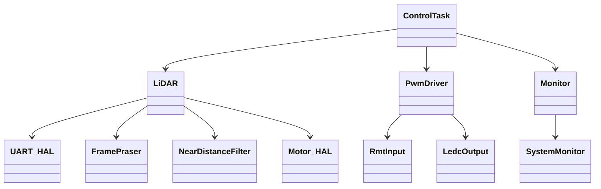
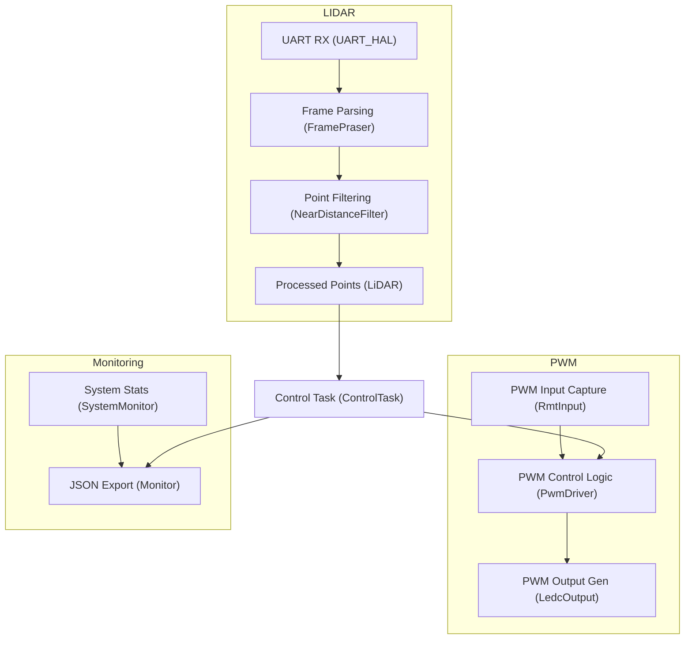

# 🚗 DigiToys Firmware Overview

This firmware powers a smart RC car platform equipped with ADAS-like functionality using LiDAR sensors and PWM-controlled actuators. It is modular, built on top of ESP-IDF, and structured for clarity, portability, and expandability.

## 📐 Architecture Overview

The DigiToys firmware is structured around a real-time control task that orchestrates LiDAR-based obstacle detection and PWM-based motion control.

At the core is the **`ControlTask`**, running on FreeRTOS, which continuously:

- Reads point cloud data from the LiDAR sensor
- Filters out near-noise using a configurable threshold
- Decides whether to override throttle signal based on obstacle proximity
- Logs system metrics for diagnostic purposes

The software architecture is composed of the following modules:

- **`lidar-driver`**: Handles UART-based LiDAR communication, frame parsing, filtering, and motor control.
- **`adas-pwm-driver`**: Manages bidirectional PWM signals, allowing passthrough from RC receiver or override by safety logic.
- **`monitor`**: Extracts heap, CPU, and task metrics and serializes them to JSON for web-based dashboards.

All components are linked via a shared context (`ControlContext`) and orchestrated by the `ControlTask`.

## 🧠 Functional Flow

The entire application is orchestrated by a real-time `ControlTask`, which reads LiDAR data, evaluates obstacle distance, and adjusts the output PWM signal accordingly.

## 🧩 Component Responsibilities

### 🟢 lidar-driver

| Class              | Responsibility |
|--------------------|----------------|
| `LiDAR`            | Central LiDAR interface. Used by `ControlTask` to access filtered point data. |
| `FramePraser`      | Parses UART stream into LiDAR frames. |
| `LiDARConfig`      | Configuration (UART, filtering thresholds). |
| `UART_HAL`         | Initializes UART and provides buffered RX. |
| `Motor_HAL`        | Controls LiDAR motor power. |
| `NearDistanceFilter` | Filters out nearby noise. |
| `PointData`        | Represents individual scan points. |

### 🟡 adas-pwm-driver

| Class                 | Responsibility |
|-----------------------|----------------|
| `IPwmChannel`         | Abstract PWM interface. |
| `RmtInput`            | Captures PWM input (from RC receiver). |
| `LedcOutput`          | Outputs PWM (to motor/servo). |
| `PwmPassthroughChannel` | Copies input directly to output. |
| `PwmDriver`           | Manages channels and override logic based on obstacle data. |

### 🔵 monitor

| Class            | Responsibility |
|------------------|----------------|
| `SystemMonitor`  | Reads FreeRTOS stats: heap, CPU, tasks. |
| `Monitor`        | Serializes monitor data to JSON (dashboard export). |

👉 [See the component details](./../doc/component-details.md)

## 🚦 Runtime Behavior Summary

1. **ControlTask** (in `main.cpp`):
   - Reads data from `LiDAR`.
   - Detects proximity threats.
   - Overrides throttle PWM using `PwmDriver`.
   - Feeds runtime metrics to `Monitor`.

2. **LiDAR Subsystem**:
   - Captures and filters obstacle data.
   - Provides structured point cloud.

3. **PWM Subsystem**:
   - Passes RC signal or overrides it to brake on threat.

4. **System Monitor**:
   - Publishes internal health and metrics to dashboard.

---

🧠 Designed for real-time embedded control on ESP32-C6 with safety-critical behavior, extensible interfaces, and modular structure.

