## 🏎️ PWM Signal Interceptor

### 🎯 Final Goal

Build an **intelligent signal interceptor** on ESP32-C6 that:

* **Accurately reads** standard RC PWM inputs (1–2 ms pulses at \~62 Hz) via RMT peripheral.
* **Decides** in real time whether to forward the raw signal or override it (e.g. in case of obstacles).
* **Generates** the appropriate PWM output for servos/ESCs on any GPIO via LEDC.

### ✅ Why RMT RX + LEDC

| Feature            | Benefit                                                           |
| ------------------ | ----------------------------------------------------------------- |
| ⏱️ **RMT RX**      | Hardware captures pulse widths without busy‐polling.              |
| 📤 **LEDC**        | High‐resolution PWM generation on flexible pins.                  |
| 🧠 **Logic**       | C++ layer sits between RMT→LEDC to inspect/modify duty cycles.    |
| 🔁 **Low Latency** | Sub‐ms reaction (<200 µs) from input edge to output update.       |
| 💡 **Scalable**    | Adding LiDAR or other sensors simply augments the decision stage. |

### 📐 RC PWM Specs

* **Pulse width:** 1.0 – 2.0 ms (1.5 ms neutral)
* **Period:** \~16 ms (62 Hz)
* **Voltage:** 3.3 V logic (ensure level compatibility)

###  End-to-end architecture

```mermaid
flowchart TD
    subgraph ESP32-C6 DevKitC-1
        %% Input paths
        RC_RX["📥 RMT RX (RmtInput)"] --> Passthrough["PwmPassthroughChannel"]
        LiDAR["📡 LiDAR Driver (UART DMA)"] --> LidarTask["🔄 LidarTask"]
        
        %% Control logic
        LidarTask --> Control["🧠 ControlTask"]
        Passthrough -. PassthroughDuty .-> Control        
        Control -->|pass-through / override| Passthrough
        
        %% Output path
        Passthrough --> LEDC["📤 LEDC Output (LedcOutput)"]
        LEDC --> ESC["⚡ ESC / Servo"]
    end

```



---

## 🏗️ C++ Driver Architecture


```cpp
namespace adas {

struct PwmChannelConfig {
    gpio_num_t       rx_gpio;      // RMT input pin
    gpio_num_t       tx_gpio;      // LEDC output pin
    ledc_channel_t   ledc_channel; // LEDC channel (0..7)
    ledc_timer_t     ledc_timer;   // LEDC timer (0..3)
    uint32_t         pwm_freq_hz;  // e.g. 50–62 Hz
};

class RmtInput {
public:
    explicit RmtInput(const PwmChannelConfig& cfg);
    esp_err_t start(std::function<void(float)> duty_cb);
    esp_err_t stop();
};

class LedcOutput {
public:
    explicit LedcOutput(const PwmChannelConfig& cfg);
    esp_err_t setDuty(float duty_norm);
};

class PwmPassthroughChannel {
public:
    explicit PwmPassthroughChannel(const PwmChannelConfig& cfg);
    esp_err_t start();           // launch RMT→LEDC task
    esp_err_t stop();            // stop RMT, leave LEDC configured
    esp_err_t setDuty(float d);  // override LEDC duty
};

class PwmDriver {
public:
    explicit PwmDriver(std::vector<PwmChannelConfig> configs);
    esp_err_t initialize();      // config & start all channels
    esp_err_t shutdown();        // stop all RMT tasks
    esp_err_t pausePassthrough(size_t idx);
    esp_err_t resumePassthrough(size_t idx);
    esp_err_t setDuty(size_t idx, float duty_norm);
};

}
```

— All APIs return `esp_err_t` (use `ESP_ERROR_CHECK` at call sites).

### Implementation Highlights

* **`RmtInput`**

  * Wraps `rmt_new_rx_channel` + ISR callback → FreeRTOS task.
  * Measures `duration0` from `rmt_rx_done_event_data_t`, normalizes to \[0..1], and invokes user callback.

* **`LedcOutput`**

  * Configures `ledc_timer_config_t` (bit depth 15) and `ledc_channel_config_t`.
  * `setDuty()` clamps input, computes ticks = `duty_norm * ((1<<15)-1)` and calls `ledc_set_duty` + `ledc_update_duty`.

* **`PwmPassthroughChannel`**

  * Composes one `RmtInput` + one `LedcOutput`.
  * `start()` wires `RmtInput` callback to `LedcOutput::setDuty()`.

* **`PwmDriver`**

  * Holds `N` channels in a vector.
  * `initialize()` → `start()` each channel; `shutdown()` → `stop()`.
  * `pausePassthrough(idx)`/`resumePassthrough(idx)` stop/restart only the RMT input; LEDC stays configured.
  * `setDuty(idx, d)` lets control logic override duty without touching RMT.

---

## 🚀 Integration Snippet

```cpp
extern "C" void app_main() {
    // 1) Configure one or two channels
    std::vector<adas::PwmChannelConfig> cfg = {
      { GPIO_NUM_18, GPIO_NUM_19, LEDC_CH0, LEDC_TIMER0, 62 },  // throttle
      // steering: { GPIO_NUM_4, GPIO_NUM_5, LEDC_CH1, LEDC_TIMER1, 62 }
    };

    // 2) Instantiate driver
    adas::PwmDriver driver{cfg};
    ESP_ERROR_CHECK(driver.initialize());

    // 3) In ControlTask or loop:
    float normalizedBrake = /* map 6% duty to normalized */;
    bool obstacle = /* from LiDAR */;
    if (obstacle) {
      ESP_ERROR_CHECK(driver.pausePassthrough(0));
      driver.setDuty(0, normalizedBrake);
    } else {
      ESP_ERROR_CHECK(driver.resumePassthrough(0));
    }
}
```