Perfect — in that case, you're absolutely on the right track with **RMT RX + LEDC**. Let's reframe it in terms of your final goal:

---

## 🏎️ Final Goal: Override RC PWM Signals

You're essentially trying to build an **"intelligent signal interceptor"**, where:

* You **read RC PWM inputs** (e.g. throttle and steering — usually 1ms to 2ms pulses at \~50Hz),
* Then decide (based on obstacles, ADAS logic, etc.) whether to:

  * **forward the signal unmodified**, or
  * **modify/block it**, and
  * **generate the desired output** toward the motor controller or steering servo.

---

## ✅ Why RMT RX + LEDC is Ideal Here

| Feature          | Why It Matters                                                            |
| ---------------- | ------------------------------------------------------------------------- |
| ⏱️ RMT RX        | Accurately measures input PWM pulses without CPU-intensive polling        |
| 📤 LEDC          | Can generate clean, servo-grade PWM signals on any GPIO                   |
| 🧠 Separation    | Your logic can sit in between RMT and LEDC to inspect/modify signal       |
| 🔁 Low Latency   | Minimal delay in mirroring signals (sub-ms, typically <200 µs achievable) |
| 💡 Expandability | You can later plug in LiDAR/IR sensors to override the signal             |

---

## 🧠 Architectural Sketch (ADAS-aware RC PWM Passthrough)

```mermaid
flowchart TD
    A["📥 PWM IN (Steering/Throttle)"] -->|RMT RX| B[📏 Decode Pulse Widths]
    B --> C[🧠 Logic: Is It Safe to Pass?]
    C -->|Yes| D[📤 Generate PWM via LEDC]
    C -->|No, Override| E[⚠️ Modify or Hold Signal] --> D
    D --> F["🔧 PWM OUT to Servo/ESC"]
```

---

## 📐 RC Servo Signal Specs (Usually)

* Pulse Width: **1.0–2.0 ms** (1.5 ms = center/neutral)
* Repetition Rate: **50 Hz** (20 ms period)
* Voltage: **3.3V or 5V** (ESP32 is 3.3V tolerant — ensure level compatibility!)

---

## 💡 Tips for Real-World Success

* **Debounce + filter** noisy RMT samples (servo signals can jitter).
* Add **a watchdog**: if no input signal for X ms, go to safe state.
* Later, you can add **LiDAR logic** to dynamically change steering/throttle signals.
* LEDC can use **duty-based representation** (`duty = pulseWidth_us * 2^bit_depth / period_us`).

---

## ✅ Action Plan

Shall I go ahead and:

* 🧪 Generate the working code template: RMT RX on input GPIO, LEDC on output GPIO?
* ⚙️ Parameterize it for two channels: **Throttle** and **Steering**?
* 🔄 Include FreeRTOS task to forward RMT → LEDC?

Let’s get your signal passthrough up and running first — then we’ll plug in the “brains” of the car later.
