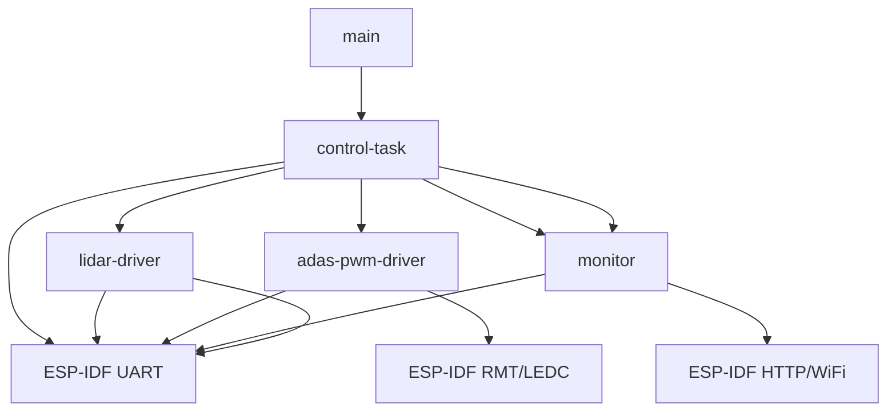

# 📚 DigiToys Firmware Documentation Index

This is the comprehensive documentation index for the DigiToys ESP32-C6 firmware. The firmware implements Autonomous Emergency Braking (AEB) for RC vehicles using LiDAR sensor technology.

## 🎯 Quick Start

- **[Main README](../README.md)** - Setup, building, and development guide
- **[Architecture Overview](./architecture-overview.md)** - High-level system design
- **[Component Details](./component-details.md)** - Individual component summaries

## 🏗️ Architecture Documentation

### System Architecture
- **[Architecture Overview](./architecture-overview.md)** - Complete system design, data flow, and component interactions
- **[FreeRTOS Task Architecture](./freertos-task-architecture.md)** - Task structure, priorities, timing, and inter-task communication

### Performance & Timing
- **[Timing and Performance Analysis](./timing-and-performance.md)** - Detailed performance metrics, optimization, and benchmarking
- **[Safety and Control Logic](./safety-and-control-logic.md)** - Safety mechanisms, control algorithms, and fail-safe behaviors

## 🔧 Component Documentation

### Core Components
- **[Control Task](./control-task.md)** - Main control logic, state management, and safety algorithms ⭐ **Most Critical**
- **[LiDAR Driver](./lidar-driver.md)** - Sensor interface, data processing, and motor control
- **[ADAS PWM Driver](./adas-pwm-driver.md)** - PWM signal capture, brake override, and RC passthrough
- **[Monitor](./monitor.md)** - System telemetry, web dashboard, and metrics collection

### Infrastructure & Development
- **[Centralized Logging System](./centralized-logging.md)** - Production-ready logging with simplified 2-parameter API ⭐ **New**

### Supporting Components
- **[BMI270 Driver](./bmi270-driver.md)** - Accelerometer driver (available but not currently integrated)

### Specialized Documentation
- **[PWM Capture & Generation](./PWM-capture-generation.md)** - Detailed PWM signal handling
- **[Slowdown Algorithm](./slowdown-algo.md)** - Progressive speed control implementation

## 📊 System Specifications

### Key Metrics
| Metric | Value | Notes |
|--------|-------|-------|
| **Control Frequency** | 20Hz (50ms) | Safety-critical timing |
| **Brake Response** | <100ms | Obstacle detection to brake |
| **LiDAR Processing** | 100Hz (10ms) | Sensor data acquisition |
| **CPU Utilization** | ~25% typical | 40% peak load |
| **Memory Usage** | ~180KB | Total RAM utilization |

### Hardware Requirements
- **MCU**: ESP32-C6 @ 160MHz
- **LiDAR**: LD19 360° sensor via UART
- **RC Interface**: Standard PWM signals (1-2ms pulses)
- **Power**: 3.3V logic, 5V LiDAR supply

## 🛡️ Safety Features

### Multi-Layer Safety
1. **Hardware Level**: Fail-safe PWM defaults, watchdog timers
2. **Driver Level**: Input validation, signal conditioning
3. **Application Level**: Dynamic thresholds, state machines
4. **System Level**: Error recovery, monitoring

### Safety States
- **🟢 Normal Operation**: RC passthrough with monitoring
- **🟡 Warning State**: Progressive intervention alerts
- **🟠 Slowdown State**: Gradual speed reduction
- **🔴 Emergency Brake**: Full brake override
- **🔵 Reverse Mode**: All safety states cleared

### Response Times
- **Obstacle Detection**: <50ms sensor to detection
- **Control Decision**: <20ms processing time
- **Brake Application**: <30ms command to output
- **Total Response**: <100ms end-to-end

## 📈 Development Information

### Project Structure
```
digitoys-firmware/
├── main/                 # Application entry point
├── components/           # Modular components
│   ├── control-task/     # Main control logic ⭐
│   ├── lidar-driver/     # LiDAR sensor interface
│   ├── adas-pwm-driver/  # PWM signal management
│   ├── monitor/          # Telemetry and web interface
│   ├── digitoys-core/    # Infrastructure framework ⭐ NEW
│   └── bmi270-driver/    # Accelerometer (unused)
├── doc/                  # Comprehensive documentation
├── dashboard/           # Web monitoring interface
├── build/               # Build artifacts
└── .devcontainer/       # Development environment
```

### Component Dependencies


## 🔄 FreeRTOS Tasks

### Task Hierarchy
```
Priority Level 4 (IDLE+2):
└── ControlTask (8KB stack, 50ms period) - Safety control logic

Priority Level 3 (IDLE+1):
├── lidar_task (4KB stack, 10ms period) - Sensor data processing
├── rmt_in_task (4KB stack, event-driven) - PWM input capture
├── httpd (4KB stack, event-driven) - Web server
└── wifi_task (3.5KB stack, event-driven) - Network management
```

### Communication Patterns
- **Atomic Variables**: High-frequency sensor data (LiDAR, PWM)
- **Mutex Protection**: Shared telemetry structures
- **Event Queues**: Interrupt to task communication
- **Direct Calls**: Control commands to drivers

## 📊 Performance Characteristics

### Timing Analysis
- **Control Loop**: 50.2ms ± 0.5ms typical
- **LiDAR Processing**: 8.5ms average per cycle
- **PWM Processing**: 0.6ms per RC signal event
- **HTTP Response**: 7-15ms per request

### Resource Utilization
- **Stack Usage**: 50-75% of allocated space
- **Heap Usage**: ~180KB total system
- **CPU Load**: 25% average, 40% peak
- **Network**: 1Hz telemetry, 1Hz system stats

## 🔍 Monitoring and Debugging

### Web Dashboard
- **Main Dashboard**: `http://<device-ip>/` - Real-time telemetry
- **System Monitor**: `http://<device-ip>/system` - Performance metrics
- **API Endpoints**: JSON data for custom monitoring

### Serial Console
- **Build Logs**: Real-time compilation output
- **Runtime Logs**: System diagnostics and debug info
- **Performance Stats**: Task and memory statistics

### Diagnostic Tools
- Stack usage monitoring
- CPU utilization tracking
- Memory leak detection
- Timing analysis tools

## 🛠️ Development Workflow

### Environment Setup
1. Install VS Code + Docker + Dev Containers extension
2. Clone repository and open in container
3. Extension auto-configures ESP-IDF v6.0
4. Build, flash, and monitor via VS Code interface

### Building and Testing
```bash
# Build project
idf.py build

# Flash to device  
idf.py flash

# Monitor output
idf.py monitor

# Run all in one
idf.py flash monitor
```

### Adding Components
1. Create component folder in `components/`
2. Implement source files and CMakeLists.txt
3. Add to main CMakeLists.txt if needed
4. Document in appropriate doc files

## 📖 Documentation Standards

### File Naming Convention
- `component-name.md` - Individual component docs
- `architecture-*.md` - System-level architecture
- `*-and-*.md` - Cross-cutting concerns

### Documentation Structure
1. **Purpose & Overview** - What and why
2. **Architecture Diagrams** - Visual system design
3. **API Documentation** - Public interfaces
4. **Usage Examples** - Practical implementation
5. **Performance Data** - Metrics and benchmarks

### Diagram Standards
- **Mermaid syntax** for all diagrams
- **Component diagrams** for static structure
- **Sequence diagrams** for timing interactions
- **State diagrams** for control logic
- **Flowcharts** for algorithmic processes

## 🚀 Future Enhancements

### Planned Features
- [ ] Steering control integration
- [ ] Machine learning obstacle prediction
- [ ] Advanced path planning algorithms
- [ ] Multi-sensor fusion (LiDAR + accelerometer)
- [ ] OTA firmware updates

### Performance Optimizations
- [ ] Fixed-point arithmetic for control calculations
- [ ] Hardware acceleration utilization
- [ ] Advanced FreeRTOS scheduling
- [ ] Memory usage optimization

### Safety Improvements
- [ ] Redundant sensor inputs
- [ ] Advanced fault detection
- [ ] Formal verification methods
- [ ] ISO 26262 compliance assessment

---

## 📋 Documentation Checklist

### ✅ Completed Documentation
- [x] Main README with quick start
- [x] Architecture overview and system design
- [x] FreeRTOS task architecture and timing
- [x] Control task comprehensive documentation
- [x] Component detail summaries
- [x] Timing and performance analysis
- [x] Safety and control logic documentation
- [x] Development workflow and standards

### 📝 Maintenance Notes
- **Last Updated**: August 26, 2025
- **Version**: 1.0.0 (Initial comprehensive documentation)
- **Reviewers**: Development team
- **Next Review**: Quarterly or after major changes

This documentation provides a complete reference for understanding, developing, and maintaining the DigiToys firmware. For questions or clarifications, refer to the specific component documentation or contact the development team.
