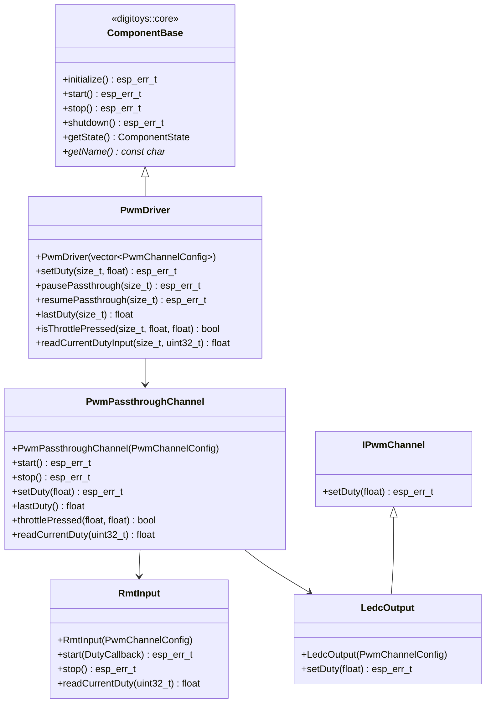

# 🟡 Component: adas-pwm-driver

This component handles reading PWM signals from external RC sources (e.g., receiver throttle) and generating corresponding PWM output signals. It allows ADAS control to override the output duty cycle during emergency conditions such as obstacle detection.

## Basic blocks

### `IPwmChannel`
- Abstract base class for all PWM signal providers
- Interface methods:
  - `setDuty(float)` - Set PWM duty cycle

### `RmtInput`
- Captures PWM signal using RMT peripheral
- Decodes high/low durations and calculates:
  - Frequency
  - Duty cycle
- Provides callbacks and direct reading methods

### `LedcOutput`
- Outputs PWM via LEDC driver
- Accepts target duty and applies smoothing
- Can be overridden by ADAS logic

### `PwmPassthroughChannel`
- Passes duty cycle from input to output directly
- Optional fallback for manual driving mode
- Provides throttle detection and direct RC reading

### `PwmDriver`
- Core of ADAS PWM control
- Maintains mapping of channels
- Can:
  - Read input from `RmtInput`
  - Write to `LedcOutput`
  - Decide based on override logic from `ControlTask`

## Class Diagram



---

## Public API

### `PwmDriver::PwmDriver(std::vector<PwmChannelConfig> configs)`

**Description:**  
Creates a PWM driver with multiple channel configurations. Inherits from `ComponentBase` for standardized lifecycle management.

**Parameters:**  
- `configs`: Vector of PWM channel configurations

**Example:**
```cpp
std::vector<PwmChannelConfig> configs = {
    PwmChannelConfig::createThrottleConfig(),
    PwmChannelConfig::createSteeringConfig()
};
PwmDriver driver(configs);
```

---

### `PwmDriver::initialize()`

**Description:**  
Initializes the PWM driver component (ComponentBase interface).

**Returns:**  
- `ESP_OK` on success, error code otherwise

---

### `PwmDriver::start()`

**Description:**  
Starts all PWM channels and sets component state to RUNNING.

**Returns:**  
- `ESP_OK` on success, error code otherwise

---

### `PwmDriver::setDuty(size_t idx, float duty)`

**Description:**  
Sets the PWM duty cycle for a specific channel.

**Parameters:**  
- `idx`: Channel index
- `duty`: Duty cycle (0.0-1.0)

**Example:**
```cpp
driver.setDuty(0, 0.06f); // Apply brake on channel 0
```

---

### `PwmDriver::pausePassthrough(size_t idx)`

**Description:**  
Stops RMT input capture for a channel while keeping LEDC output active.

**Parameters:**  
- `idx`: Channel index

---

### `PwmDriver::resumePassthrough(size_t idx)`

**Description:**  
Restarts RMT input capture for a channel.

**Parameters:**  
- `idx`: Channel index

---

### `PwmDriver::lastDuty(size_t idx)`

**Description:**  
Returns the last captured duty cycle for a channel.

**Parameters:**  
- `idx`: Channel index

**Returns:**  
- Last captured duty cycle (0.0-1.0)

---

### `PwmDriver::isThrottlePressed(size_t idx, float center, float range)`

**Description:**  
Checks if throttle is pressed outside neutral range.

**Parameters:**  
- `idx`: Channel index
- `center`: Neutral center point (default from constants)
- `range`: Neutral range width (default from constants)

**Returns:**  
- `true` if throttle is pressed, `false` otherwise

---

### `PwmDriver::readCurrentDutyInput(size_t idx, uint32_t timeout_ms)`

**Description:**  
Reads fresh RC input directly from RMT (bypasses passthrough state).

**Parameters:**  
- `idx`: Channel index
- `timeout_ms`: Read timeout (default 100ms)

**Returns:**  
- Current duty cycle or INVALID_DUTY on timeout

---
