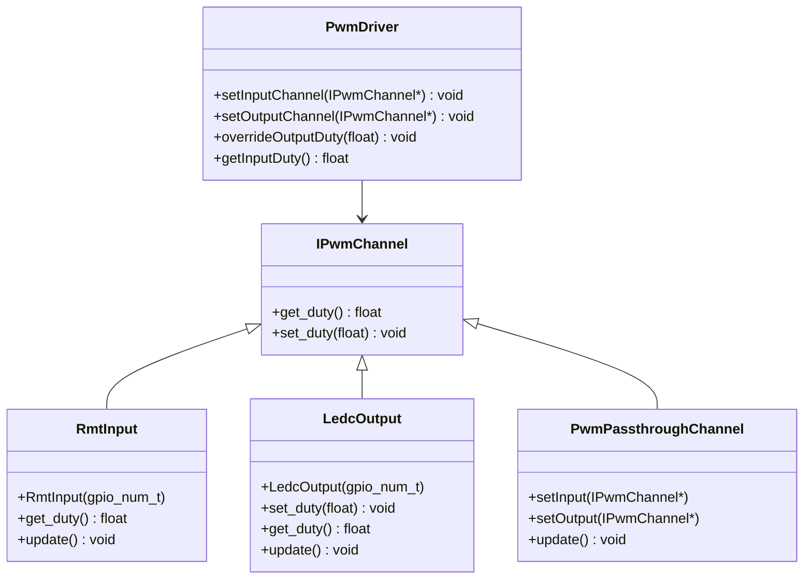

# 🟡 Component: adas-pwm-driver

This component handles reading PWM signals from external RC sources (e.g., receiver throttle) and generating corresponding PWM output signals. It allows ADAS control to override the output duty cycle during emergency conditions such as obstacle detection.

## Basic blocks

### `IPwmChannel`
- Abstract base class for all PWM signal providers
- Interface methods:
  - `get_duty()`
  - `set_duty(float)`
  - `update()` (optional polling)

### `RmtInput`
- Captures PWM signal using RMT peripheral
- Decodes high/low durations and calculates:
  - Frequency
  - Duty cycle
- Acts as input channel in `PwmDriver`

### `LedcOutput`
- Outputs PWM via LEDC driver
- Accepts target duty and applies smoothing
- Can be overridden by ADAS logic

### `PwmPassthroughChannel`
- Passes duty cycle from input to output directly
- Optional fallback for manual driving mode

### `PwmDriver`
- Core of ADAS PWM control
- Maintains mapping of channels
- Can:
  - Read input from `RmtInput`
  - Write to `LedcOutput`
  - Decide based on override logic from `ControlTask`

## Class Diagram



---

## Public API

### `RmtInput::RmtInput(gpio_num_t pin)`

**Description:**  
Creates a new RMT input object bound to a specific GPIO pin.

**Example:**
```cpp
RmtInput input(GPIO_NUM_5);
```

---

### `RmtInput::get_duty()`

**Returns:**  
- Last measured duty cycle (0.0–1.0)

---

### `LedcOutput::LedcOutput(gpio_num_t pin)`

**Description:**  
Creates a new LEDC PWM output object on a given GPIO pin.

**Example:**
```cpp
LedcOutput output(GPIO_NUM_18);
```

---

### `LedcOutput::set_duty(float value)`

**Description:**  
Sets the target PWM duty cycle.

**Parameters:**  
- `value`: A float between 0.0 and 1.0

---

### `LedcOutput::get_duty()`

**Returns:**  
- Last set duty cycle

---

### `PwmDriver::setInputChannel(IPwmChannel*)`

**Description:**  
Registers a channel (typically `RmtInput`) as the duty source.

---

### `PwmDriver::setOutputChannel(IPwmChannel*)`

**Description:**  
Registers a channel (typically `LedcOutput`) as the PWM destination.

---

### `PwmDriver::overrideOutputDuty(float duty)`

**Description:**  
Overrides the current output PWM with a specified value.

**Parameters:**  
- `duty`: Throttle or brake override value

**Example:**
```cpp
pwmDriver.overrideOutputDuty(0.06f); // Brake
```

---

### `PwmDriver::getInputDuty()`

**Returns:**  
- Duty cycle from the current input channel (e.g., throttle from RC)

---
