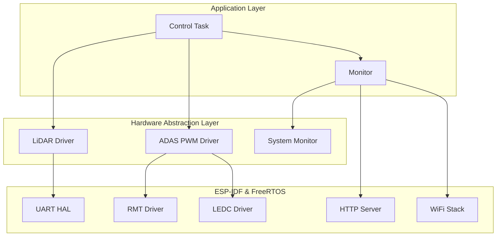
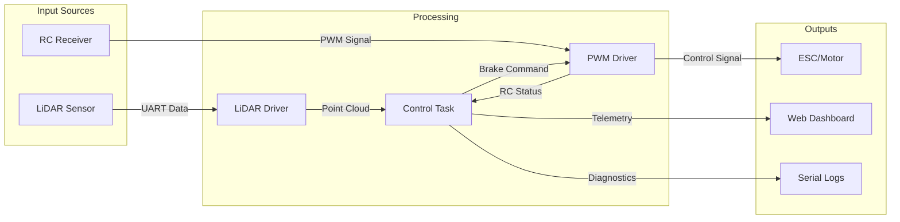
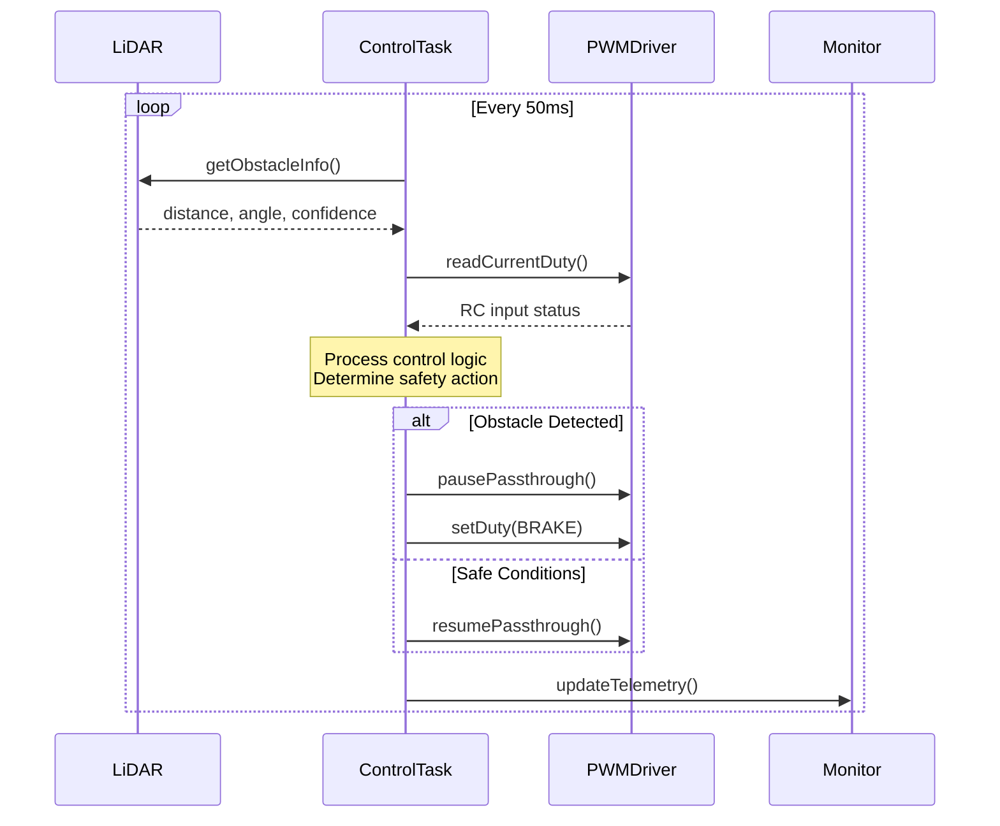
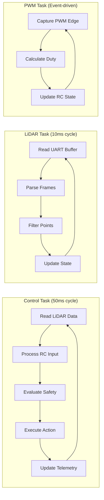
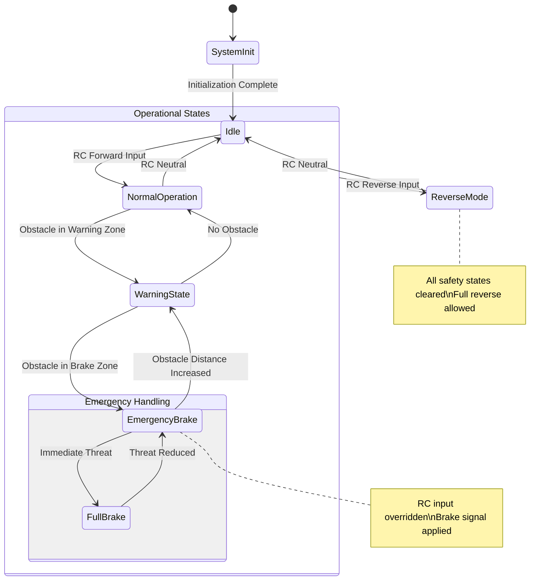

# 🏗️ DigiToys Firmware Architecture Overview

This document provides a comprehensive high-level view of the DigiToys firmware architecture, covering both component-level and system-level perspectives. The firmware implements an ADAS-like safety system for RC vehicles using ESP32-C6.

## 🎯 System Purpose

The DigiToys firmware creates an **Autonomous Emergency Braking (AEB)** system for RC vehicles by:
- **Detecting obstacles** using LiDAR sensor data
- **Monitoring RC input** from the vehicle's receiver
- **Applying safety interventions** when obstacles are detected
- **Providing telemetry** for monitoring and debugging

## 📊 Component Architecture

### Component Hierarchy

### Component Responsibilities

| Component | Purpose | Key Functions |
|-----------|---------|---------------|
| **control-task** | Main control logic orchestrator | Safety algorithms, state management, decision making |
| **lidar-driver** | LiDAR sensor interface | UART communication, frame parsing, motor control |
| **adas-pwm-driver** | PWM signal management | RC input capture, brake signal generation |
| **monitor** | System telemetry | Web dashboard, metrics collection, debugging |
| **bmi270-driver** | Accelerometer (unused) | Motion sensing, orientation detection |

## 🔄 Data Flow Architecture

### Primary Data Flow

### Information Flow Timing

## 🏗️ Layered Architecture

### Layer 1: Hardware Abstraction
- **UART HAL**: LiDAR communication interface
- **RMT Driver**: PWM input capture from RC receiver
- **LEDC Driver**: PWM output generation to ESC
- **GPIO Control**: LiDAR motor control, status LEDs

### Layer 2: Device Drivers
- **LiDAR Driver**: Sensor data acquisition and processing
- **PWM Driver**: Bidirectional PWM signal management
- **System Monitor**: Hardware metrics collection

### Layer 3: Application Logic
- **Control Task**: Main control algorithms and safety logic
- **Monitor**: Telemetry and web interface

### Layer 4: User Interface
- **Web Dashboard**: Real-time monitoring interface
- **Serial Console**: Debug and diagnostic output

## 🔧 Module Interactions

### Control Loop Integration

### Inter-Component Communication

| From | To | Interface | Data Type | Frequency |
|------|----|-----------|-----------|-----------| 
| Control Task | LiDAR Driver | `getObstacleInfo()` | Obstacle data | 20Hz |
| Control Task | PWM Driver | `readCurrentDuty()` | RC input | 20Hz |
| Control Task | PWM Driver | `setDuty()`/`pausePassthrough()` | Control commands | As needed |
| Control Task | Monitor | `updateTelemetry()` | System state | 20Hz |
| LiDAR Driver | UART HAL | Ring buffer read | Raw bytes | Continuous |
| PWM Driver | RMT HAL | Interrupt callback | PWM edges | Event-driven |

## 🎚️ Control System Architecture

### State Machine Overview

The control system implements a hierarchical state machine:

### Safety Architecture

**Defense in Depth:**
1. **Hardware Level**: Fail-safe PWM signal default (brake position)
2. **Driver Level**: Input validation and signal conditioning
3. **Application Level**: Multi-layered safety logic with dynamic thresholds
4. **System Level**: Watchdog monitoring and error recovery

**Safety Mechanisms:**
- **Dynamic Braking Distances**: Speed-dependent safety zones
- **Progressive Intervention**: Warning → Slowdown → Emergency brake
- **Manual Override**: Reverse motion clears all safety states
- **Signal Validation**: RC input and LiDAR data integrity checks

## 🔍 Component Detail Links

For detailed documentation of each component:

- 📡 **[LiDAR Driver](./lidar-driver.md)** - Sensor interface and data processing
- 🎛️ **[Control Task](./control-task.md)** - Main control logic and safety algorithms  
- 🔄 **[ADAS PWM Driver](./adas-pwm-driver.md)** - PWM signal capture and generation
- 📊 **[Monitor](./monitor.md)** - System telemetry and web dashboard
- 🏗️ **[FreeRTOS Task Architecture](./freertos-task-architecture.md)** - Task-level system design
- 🔧 **[Component Details](./component-details.md)** - Individual component summaries

## 📏 System Specifications

### Performance Targets
- **Control Loop Frequency**: 20Hz (50ms cycle time)
- **Brake Response Time**: <100ms from obstacle detection
- **LiDAR Update Rate**: 100Hz (10ms processing cycle)
- **RC Input Latency**: <50ms signal processing delay

### Resource Utilization
- **CPU Usage**: ~25% under normal operation
- **Memory Usage**: ~180KB total RAM utilization
- **Flash Usage**: ~1.2MB application code
- **Network**: WiFi for monitoring dashboard

### Environmental Requirements
- **Operating Voltage**: 3.3V (ESP32-C6)
- **LiDAR Power**: 5V external supply
- **RC Signal Levels**: 3.3V/5V compatible
- **Operating Temperature**: -10°C to +70°C

---

This architecture provides a robust, safety-critical control system suitable for autonomous emergency braking in RC vehicles, with comprehensive monitoring and debugging capabilities.
