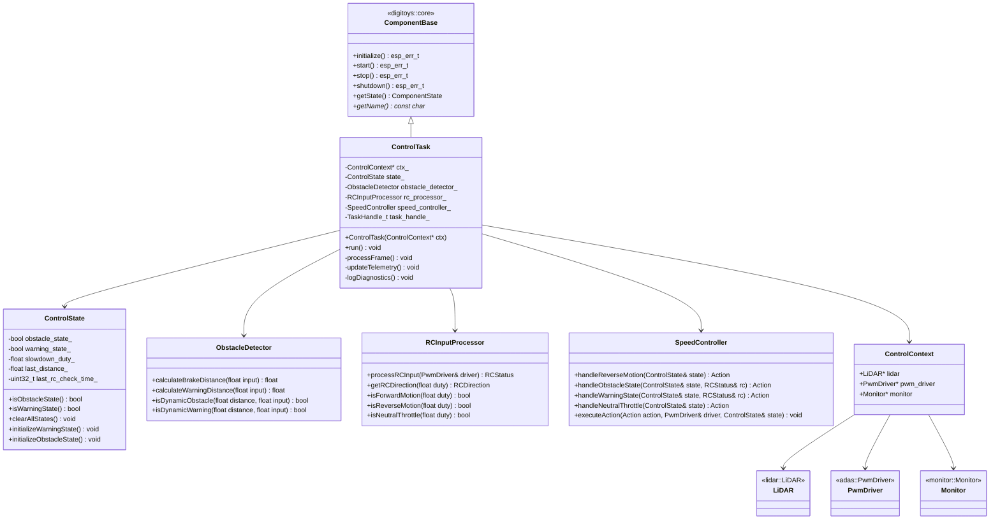
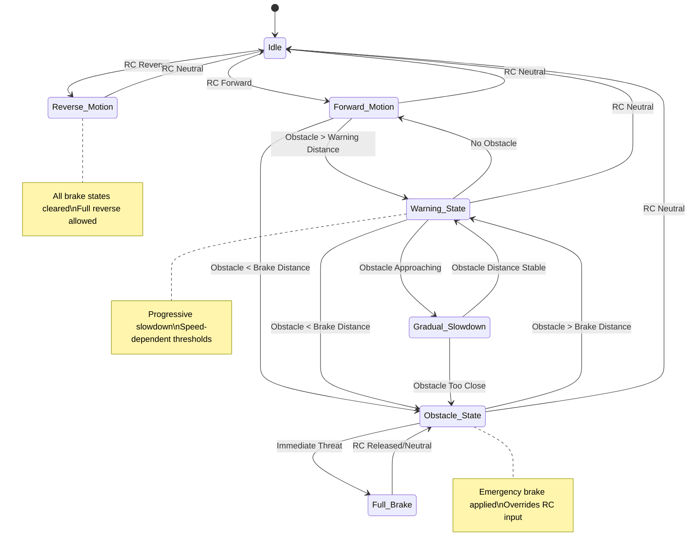

# 🎛️ Component: control-task

This component is the **heart of the DigiToys firmware**, implementing the main control logic that orchestrates LiDAR-based obstacle detection, RC input processing, and safety-critical speed control. It runs as the highest-priority application task and implements sophisticated ADAS-like functionality.

## Basic blocks

### `ControlTask`
- **Main orchestrator** running at 50ms intervals
- Coordinates all control subsystems
- Implements the primary control loop:
  - Reads LiDAR obstacle information
  - Processes RC input signals
  - Determines appropriate control actions
  - Executes speed control commands
  - Updates telemetry and diagnostics

### `ControlState`
- **State management** for the entire control system
- Maintains current system state (obstacle, warning, braking)
- Stores dynamic control parameters (slowdown duty, distances)
- Provides thread-safe state transitions
- Tracks timing information for state-dependent operations

### `ObstacleDetector`
- **Dynamic threat assessment** with adaptive thresholds
- Calculates brake and warning distances based on current speed
- Implements sophisticated obstacle detection logic:
  - Speed-dependent braking distances (0.5m - 3.5m)
  - Speed-dependent warning distances (1.0m - 5.0m)
  - Handles both static and dynamic obstacle scenarios

### `RCInputProcessor`
- **RC signal interpretation** and validation
- Processes PWM duty cycles from RC receiver
- Determines vehicle direction (forward/reverse/neutral)
- Provides fresh RC input data with configurable refresh rates
- Implements input filtering and validation

### `SpeedController`
- **Safety-critical speed control** with multiple control modes
- Executes control actions based on system state:
  - `RESUME_PASSTHROUGH` - Normal RC control
  - `APPLY_BRAKE` - Emergency full brake
  - `GRADUAL_SLOWDOWN` - Progressive speed reduction
  - `MAINTAIN_SPEED` - Hold current speed
  - `CLEAR_WARNING` - Clear warning conditions
- Manages PWM driver interface for brake/throttle control

## Class Diagram



## Control Flow State Machine



## Public API

### `ControlTask::ControlTask(ControlContext* ctx)`

**Description:**  
Constructs the main control task with hardware interface context. Inherits from `ComponentBase` for standardized lifecycle management and registers with the centralized logging system.

**Parameters:**  
- `ControlContext* ctx`: Pointer to hardware interfaces (LiDAR, PWM driver, monitor)

**Example:**
```cpp
static control::ControlContext ctx = {&lidar, &pwm_driver, &monitor};
static control::ControlTask control_task(&ctx);
```

---

### `ControlTask::initialize()`

**Description:**  
Initializes the control task component (ComponentBase interface). Validates the control context and sets component state to INITIALIZED.

**Returns:**  
- `ESP_OK` on success, error code on validation failure

---

### `ControlTask::start()`

**Description:**  
Starts the control task as a FreeRTOS task and sets component state to RUNNING.

**Returns:**  
- `ESP_OK` on success, error code on task creation failure

---

### `ControlTask::stop()`

**Description:**  
Stops the control task and sets component state to STOPPED.

**Returns:**  
- `ESP_OK` on success, error code otherwise

---

### `ControlTask::shutdown()`

**Description:**  
Completely shuts down the control task and sets component state to UNINITIALIZED.

**Returns:**  
- `ESP_OK` on success, error code otherwise

---

### `ControlTask::run()`

**Description:**  
Main task execution loop. Runs continuously with 50ms cycle time, processing control frames and updating system state.

**Control Loop:**
1. Process current frame (`processFrame()`)
2. Update telemetry (`updateTelemetry()`)
3. Log diagnostics (`logDiagnostics()`)
4. Wait 50ms (`vTaskDelay`)

---

### `ControlState` State Management

**Core State Variables:**
- `obstacle_state_`: Emergency braking active
- `warning_state_`: Progressive slowdown active
- `slowdown_duty_`: Current slowdown PWM duty
- `last_distance_`: Last measured obstacle distance
- `last_rc_check_time_`: Timestamp of last RC input check

**State Operations:**
```cpp
// Clear all control states
state.clearAllStates();

// Initialize warning state with current conditions
state.initializeWarningState(current_duty, distance, timestamp);

// Initialize obstacle/brake state
state.initializeObstacleState(timestamp);
```

---

### `ObstacleDetector` Dynamic Thresholds

**Speed-Dependent Distance Calculation:**
```cpp
ObstacleDetector detector;
float brake_distance = detector.calculateBrakeDistance(rc_input);
float warning_distance = detector.calculateWarningDistance(rc_input);

bool is_obstacle = detector.isDynamicObstacle(measured_distance, rc_input);
bool is_warning = detector.isDynamicWarning(measured_distance, rc_input);
```

**Distance Ranges:**
- **Brake Distance**: 0.5m (minimum) to 3.5m (maximum)
- **Warning Distance**: 1.0m (minimum) to 5.0m (maximum)
- **Speed Scaling**: Higher RC input = longer braking distances

---

### `RCInputProcessor` Signal Analysis

**RC Input Processing:**
```cpp
RCInputProcessor processor;
auto rc_status = processor.processRCInput(pwm_driver);

// Check vehicle direction
RCDirection direction = processor.getRCDirection(rc_status.current_input);
bool forward = processor.isForwardMotion(rc_status.current_input);
bool reverse = processor.isReverseMotion(rc_status.current_input);
bool neutral = processor.isNeutralThrottle(rc_status.current_input);
```

**RC Status Structure:**
```cpp
struct RCStatus {
    float current_input;     // Current PWM duty cycle
    RCDirection direction;   // FORWARD, REVERSE, NEUTRAL
    bool input_valid;        // Input validation status
};
```

---

### `SpeedController` Action Execution

**Control Actions:**
```cpp
SpeedController controller;

// Determine action based on current state
auto action = controller.handleObstacleState(state, rc_status);

// Execute the determined action
controller.executeAction(action, pwm_driver, state);
```

**Available Actions:**
- `RESUME_PASSTHROUGH`: Normal RC control
- `APPLY_BRAKE`: Emergency full brake (6% duty)
- `GRADUAL_SLOWDOWN`: Progressive speed reduction
- `MAINTAIN_SPEED`: Hold current speed setting
- `CLEAR_WARNING`: Clear warning state
- `NO_ACTION`: No intervention required

## Control Constants

### PWM Duty Cycle Constants
```cpp
static constexpr float BRAKE = 0.058f;              // Full brake duty (6%)
static constexpr float ZERO_SPEED = 0.0856f;        // Neutral duty (~8.5%)
static constexpr float DUTY_STEP = 0.005f;          // Increment step (0.5%)
static constexpr float DIRECTION_TOLERANCE = 0.005f; // Direction detection tolerance
```

### Dynamic Braking Parameters
```cpp
static constexpr float MIN_BRAKE_DISTANCE = 0.5f;   // Minimum brake distance
static constexpr float MAX_BRAKE_DISTANCE = 3.5f;   // Maximum brake distance
static constexpr float MIN_WARNING_DISTANCE = 1.0f; // Minimum warning distance
static constexpr float MAX_WARNING_DISTANCE = 5.0f; // Maximum warning distance
```

### Timing Constants
```cpp
static constexpr uint32_t RC_CHECK_INTERVAL_MS = 100;  // RC check during brake
static constexpr uint32_t CONTROL_LOOP_DELAY_MS = 50;  // Main loop period
static constexpr uint32_t RC_READ_DELAY_MS = 20;       // RC refresh delay
```

### Logging Intervals
```cpp
static constexpr int DUTY_TEST_LOG_INTERVAL = 40;     // Every 2 seconds
static constexpr int THRESHOLD_LOG_INTERVAL = 40;     // Every 2 seconds
```

## FreeRTOS Integration

### Task Creation
```cpp
// In main.cpp
BaseType_t rc = xTaskCreate(
    ControlTaskWrapper,     // Task function wrapper
    "ControlTask",          // Task name
    8192,                   // Stack size (8KB)
    &control_task,          // Task parameter
    tskIDLE_PRIORITY + 2,   // Priority (highest application task)
    nullptr                 // Task handle (not stored)
);
```

### Task Characteristics
- **Name**: `ControlTask`
- **Priority**: `tskIDLE_PRIORITY + 2` (highest application priority)
- **Stack Size**: 8192 bytes (8KB)
- **Period**: 50ms (20Hz control frequency)
- **Type**: Continuous execution with periodic delays

### Task Wrapper Function
```cpp
extern "C" void ControlTaskWrapper(void *pv) {
    auto *task = static_cast<control::ControlTask *>(pv);
    task->run();  // Never returns
}
```

## Safety Mechanisms

### Emergency Braking
- **Trigger**: Obstacle within dynamic brake distance
- **Action**: Override RC input with full brake signal (6% duty)
- **Recovery**: Manual RC release to neutral required

### Progressive Slowdown
- **Trigger**: Obstacle within warning distance but outside brake distance
- **Action**: Gradually reduce speed while maintaining some forward motion
- **Recovery**: Automatic when obstacle distance increases

### Reverse Safety
- **Behavior**: All brake/warning states immediately cleared in reverse
- **Rationale**: Allow unrestricted reverse motion for maneuvering

### Input Validation
- **RC Signal Validation**: Checks for valid PWM duty cycle ranges
- **LiDAR Data Validation**: Filters invalid or infinite distance readings
- **State Consistency**: Ensures mutually exclusive state conditions

## Performance Characteristics

### Timing Analysis
- **Control Loop**: 50ms ± <1ms jitter
- **LiDAR Processing**: 10ms cycle time
- **RC Input Refresh**: 20ms when fresh data needed
- **Brake Response Time**: <100ms from obstacle detection to brake application

### Memory Usage
- **Stack Usage**: ~4KB typical, 8KB allocated
- **Heap Usage**: Minimal (statically allocated objects)
- **State Storage**: <100 bytes per control cycle

### CPU Utilization
- **Control Task**: ~5-10% CPU utilization
- **LiDAR Task**: ~10-15% CPU utilization
- **Total System**: ~20-30% CPU utilization under normal operation

---

## Usage Example

```cpp
// Initialize hardware interfaces with ComponentBase lifecycle
LiDAR lidar{lidar_config};
ESP_ERROR_CHECK(lidar.initialize());
ESP_ERROR_CHECK(lidar.start());

PwmDriver pwm_driver{pwm_configs};
ESP_ERROR_CHECK(pwm_driver.initialize());
ESP_ERROR_CHECK(pwm_driver.start());

Monitor monitor;
ESP_ERROR_CHECK(monitor.initialize());
ESP_ERROR_CHECK(monitor.start());

// Create control context
ControlContext ctx = {&lidar, &pwm_driver, &monitor};

// Create and initialize control task
ControlTask control_task(&ctx);
ESP_ERROR_CHECK(control_task.initialize());
ESP_ERROR_CHECK(control_task.start());
```

The control task will automatically:
1. Read LiDAR obstacle data every 50ms
2. Process RC input and determine vehicle state
3. Apply appropriate control actions based on safety logic
4. Update telemetry for monitoring dashboard
5. Log diagnostic information using centralized logging
4. Update telemetry for monitoring dashboard
5. Log diagnostic information for debugging
