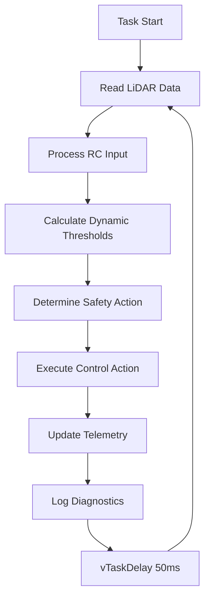
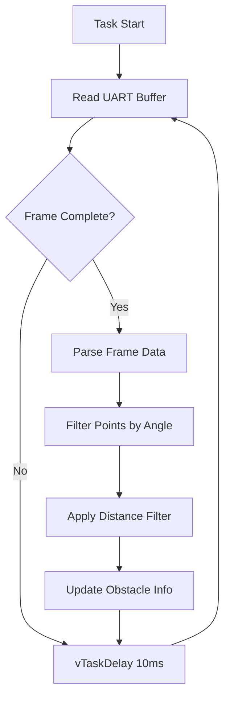
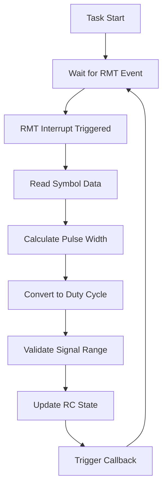
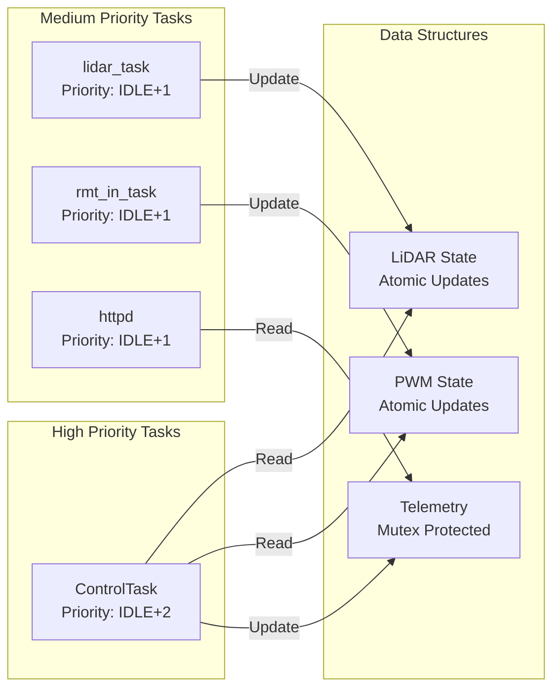
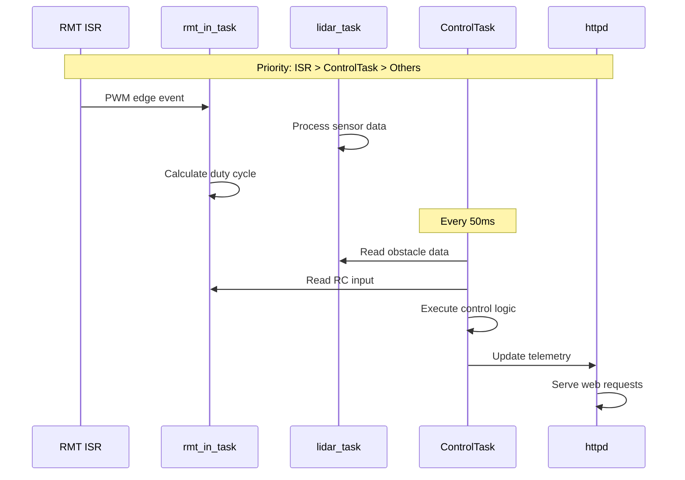

# ⚙️ FreeRTOS Task Architecture

This document provides detailed information about the FreeRTOS task structure in the DigiToys firmware, including task priorities, stack sizes, timing characteristics, and inter-task communication patterns.

## 📋 Task Overview

The DigiToys firmware uses a multi-task architecture with 4 primary application tasks plus system tasks:

| Task Name | Priority | Stack Size | Period/Trigger | CPU Usage | Purpose |
|-----------|----------|------------|----------------|-----------|---------|
| **ControlTask** | IDLE+2 | 8192 bytes | 50ms | ~5-10% | Main control logic |
| **lidar_task** | IDLE+1 | 4096 bytes | 10ms | ~10-15% | LiDAR data processing |
| **rmt_in_task** | IDLE+1 | 4096 bytes | Event-driven | ~2-5% | PWM input capture |
| **httpd** | IDLE+1 | 4096 bytes | Event-driven | ~1-3% | Web server |
| **wifi_task** | IDLE+1 | 3584 bytes | Event-driven | ~2-5% | WiFi management |

## 🎯 Task Details

### 1. ControlTask (Main Control Loop)

**Priority**: `tskIDLE_PRIORITY + 2` (Highest application priority)  
**Stack Size**: 8192 bytes (8KB)  
**Execution Pattern**: Periodic (50ms cycle)  
**CPU Usage**: 5-10% average  

```cpp
// Task Creation (main.cpp)
BaseType_t rc = xTaskCreate(
    ControlTaskWrapper,     // Function pointer
    "ControlTask",          // Task name  
    8192,                   // Stack size in words
    &control_task,          // Parameters
    tskIDLE_PRIORITY + 2,   // Priority
    nullptr                 // Task handle
);
```

**Execution Flow:**


**Stack Usage Analysis:**
- **Typical Usage**: ~4KB under normal conditions
- **Peak Usage**: ~6KB during complex control scenarios
- **Safety Margin**: 2KB reserved for interrupt handling
- **Stack Monitoring**: High water mark tracked via system monitor

**Critical Timing Requirements:**
- **Period**: 50ms ± 1ms maximum jitter
- **Brake Response**: <100ms from obstacle detection to brake application
- **RC Response**: <20ms for RC input processing

---

### 2. lidar_task (LiDAR Data Processing)

**Priority**: `tskIDLE_PRIORITY + 1`  
**Stack Size**: 4096 bytes (4KB)  
**Execution Pattern**: Periodic (10ms cycle)  
**CPU Usage**: 10-15% average  

```cpp
// Task Creation (lidar.cpp)
BaseType_t rc = xTaskCreate(
    taskEntry,              // Static function wrapper
    "lidar_task",           // Task name
    4096,                   // Stack size in words
    this,                   // LiDAR instance pointer
    tskIDLE_PRIORITY + 1,   // Priority
    &task_handle_           // Task handle storage
);
```

**Execution Flow:**


**UART Processing Characteristics:**
- **Baud Rate**: 230400 bps
- **Frame Size**: ~12 points per frame (~47 bytes)
- **Frame Rate**: ~100Hz from LiDAR sensor
- **Buffer Size**: 2048 bytes DMA buffer
- **Processing Time**: ~2-3ms per frame

**Memory Usage:**
- **DMA Buffer**: 2048 bytes (static allocation)
- **Point Data**: ~144 bytes per frame (12 points × 12 bytes)
- **Filter Buffers**: ~500 bytes for intermediate processing

---

### 3. rmt_in_task (PWM Input Capture)

**Priority**: `tskIDLE_PRIORITY + 1`  
**Stack Size**: 4096 bytes (4KB)  
**Execution Pattern**: Event-driven (PWM edge interrupts)  
**CPU Usage**: 2-5% average  

```cpp
// Task Creation (adas_pwm_driver.cpp)
BaseType_t rc = xTaskCreate(
    [](void *arg) { static_cast<RmtInput *>(arg)->taskLoop(); },
    "rmt_in_task",          // Task name
    4096,                   // Stack size in words
    this,                   // RmtInput instance
    tskIDLE_PRIORITY + 1,   // Priority
    &task_handle_           // Task handle storage
);
```

**Execution Flow:**


**RMT Configuration:**
- **Channel**: RMT channel per PWM input
- **Clock Division**: 80 (1MHz clock from 80MHz APB)
- **Symbol Buffer**: 64 symbols (128 bytes per channel)
- **Signal Range**: 500ns - 10ms (covers standard PWM range)

**PWM Signal Characteristics:**
- **Standard RC PWM**: 1000-2000μs pulse width, 50Hz frequency
- **Resolution**: ~1μs timing accuracy
- **Validation Range**: 800-2200μs (with margins)
- **Timeout**: 25ms (2 missed frames triggers timeout)

---

### 4. httpd Task (Web Server)

**Priority**: `tskIDLE_PRIORITY + 1` (ESP-IDF default)  
**Stack Size**: 4096 bytes (4KB)  
**Execution Pattern**: Event-driven (HTTP requests)  
**CPU Usage**: 1-3% average  

```cpp
// HTTP Server Configuration (Monitor.cpp)
httpd_config_t config = HTTPD_DEFAULT_CONFIG();
config.stack_size = 4096;
ESP_ERROR_CHECK(httpd_start(&server_, &config));
```

**Registered Endpoints:**
- `GET /` - Main telemetry dashboard
- `GET /telemetry` - JSON telemetry data  
- `GET /system` - System statistics JSON

**Request Processing:**
- **Telemetry Updates**: 1Hz from dashboard
- **System Stats**: 1Hz for monitoring
- **Response Time**: <10ms for JSON responses
- **Concurrent Connections**: Up to 4 simultaneous connections

---

### 5. WiFi Task (Network Management)

**Priority**: `tskIDLE_PRIORITY + 1` (ESP-IDF default)  
**Stack Size**: 3584 bytes (ESP-IDF default)  
**Execution Pattern**: Event-driven (WiFi events)  
**CPU Usage**: 2-5% average  

**WiFi Configuration:**
- **Mode**: Station (STA) mode
- **Security**: WPA2-PSK
- **Power Save**: Minimum modem sleep
- **Reconnection**: Automatic on disconnect

## 🔄 Inter-Task Communication

### Communication Mechanisms



### Synchronization Mechanisms

| Mechanism | Usage | Components | Notes |
|-----------|-------|------------|-------|
| **Atomic Variables** | LiDAR obstacle data | ControlTask ↔ lidar_task | Lock-free, high performance |
| **Atomic Variables** | PWM duty cycle | ControlTask ↔ rmt_in_task | Lock-free, real-time safe |
| **Mutex** | Telemetry data | ControlTask ↔ httpd | Protected shared structure |
| **Queue** | RMT events | ISR → rmt_in_task | Interrupt-safe communication |
| **Direct Calls** | Control commands | ControlTask → PWM Driver | Function call interface |

### Data Flow Priority



## ⏱️ Timing Analysis

### Task Scheduling

**Priority Levels:**
- **Priority 3** (IDLE+2): ControlTask - Highest application priority
- **Priority 2** (IDLE+1): lidar_task, rmt_in_task, httpd, wifi_task
- **Priority 1** (IDLE): FreeRTOS idle task
- **Priority 0+**: ESP-IDF system tasks (various priorities)

**Preemption Behavior:**
- ControlTask can preempt all other application tasks
- Same-priority tasks use time slicing (1ms quantum)
- ISRs can preempt any task (hardware priority)

### Worst-Case Timing Analysis

| Scenario | ControlTask Period | Notes |
|----------|-------------------|-------|
| **Best Case** | 50.0ms | No interference, optimal conditions |
| **Typical Case** | 50.2ms ± 0.5ms | Normal operation with WiFi traffic |
| **Worst Case** | 52.0ms | Heavy WiFi activity + LiDAR processing |
| **Critical Limit** | 55.0ms | Maximum acceptable for safety |

**Jitter Sources:**
- WiFi interrupt handling: ±1ms
- LiDAR UART processing: ±0.5ms  
- HTTP request processing: ±1ms
- FreeRTOS scheduler overhead: ±0.1ms

## 📊 Resource Utilization

### Stack Usage Monitoring

```cpp
// Stack high water mark checking (available via system monitor)
UBaseType_t highWaterMark = uxTaskGetStackHighWaterMark(taskHandle);
```

**Typical Stack Usage:**
- **ControlTask**: 4KB used / 8KB allocated (50% utilization)
- **lidar_task**: 2.5KB used / 4KB allocated (62% utilization)  
- **rmt_in_task**: 1KB used / 4KB allocated (25% utilization)
- **httpd**: 2KB used / 4KB allocated (50% utilization)

### Memory Allocation Strategy

**Static Allocation:**
- All task stacks: Static allocation at compile time
- LiDAR buffers: Static DMA buffers (2KB)
- Control state: Static objects, no dynamic allocation

**Dynamic Allocation:**
- HTTP responses: Temporary JSON strings
- WiFi management: ESP-IDF managed internally
- Minimal heap usage: <10KB total dynamic allocation

## 🛡️ Safety and Reliability

### Watchdog Configuration

```cpp
// Task watchdog configuration (ESP-IDF)
esp_task_wdt_config_t wdt_config = {
    .timeout_ms = 5000,           // 5 second timeout
    .idle_core_mask = 0,          // Don't monitor idle tasks
    .trigger_panic = true         // Panic on timeout
};
```

**Monitored Tasks:**
- ControlTask: Must feed watchdog every cycle
- Critical system tasks: ESP-IDF managed

### Error Recovery

**Task Failure Handling:**
- **ControlTask failure**: System restart (safety critical)
- **lidar_task failure**: Automatic restart with degraded mode
- **rmt_in_task failure**: RC input timeout handling
- **httpd failure**: Monitoring unavailable, control continues

**Stack Overflow Detection:**
- FreeRTOS stack overflow hooks enabled
- Stack canary checking in debug builds
- Runtime stack usage monitoring

## 🔧 Configuration and Tuning

### Task Priority Tuning

**Current Settings (Optimal for Safety):**
```cpp
#define CONTROL_TASK_PRIORITY    (tskIDLE_PRIORITY + 2)  // Highest
#define SENSOR_TASK_PRIORITY     (tskIDLE_PRIORITY + 1)  // Medium
#define COMM_TASK_PRIORITY       (tskIDLE_PRIORITY + 1)  // Medium
```

**Alternative Configurations:**
- **Performance Mode**: Increase all priorities by +1
- **Power Save Mode**: Reduce non-critical task frequencies
- **Debug Mode**: Lower ControlTask priority for better debugging

### Stack Size Optimization

**Current Allocation (Conservative):**
- ControlTask: 8KB (50% safety margin)
- Other tasks: 4KB (reasonable for functionality)

**Optimized Allocation (Future):**
- ControlTask: 6KB (based on profiling data)
- lidar_task: 3KB (sufficient for processing)
- Other tasks: 2-3KB (based on actual usage)

---

This task architecture provides robust real-time performance for safety-critical vehicle control while maintaining system monitoring and debugging capabilities.
