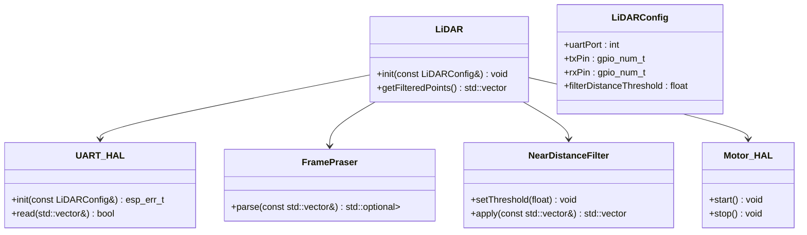

# 🟢 Component: lidar-driver

This component is responsible for reading, parsing, filtering, and managing LiDAR scan data. It handles UART configuration, frame parsing from the LiDAR's binary protocol, and filtering of noisy or too-close readings.

## Basic blocks

### `LiDAR`
- Central class coordinating:
  - UART setup and data reception via `UART_HAL`
  - Frame parsing via `FramePraser`
  - Point filtering via `NearDistanceFilter`
  - LiDAR motor control via `Motor_HAL`
- Public API includes methods to:
  - Initialize sensor
  - Fetch latest points
  - Apply filtering logic

### `FramePraser`
- Parses raw byte stream from LiDAR
- Protocol structure:
  - Header: `0x54 0x2C`
  - 12 points per frame
  - Each point: distance, angle, confidence
- Validates checksum before frame acceptance

### `NearDistanceFilter`
- Filters out points below a configurable threshold
- Used for ignoring close noise or irrelevant objects
- Helps in reducing false positives for braking

### `UART_HAL`
- Encapsulates UART initialization and RX handling
- Uses ESP-IDF ring buffer for non-blocking reads
- Exposes `read()` method returning raw frame data

### `Motor_HAL`
- Controls GPIO line powering the LiDAR motor
- Simple API: `start()` and `stop()`
- Used by `LiDAR` during setup/teardown

### `LiDARConfig`
- Struct containing:
  - UART port ID
  - Pin configuration
  - Filtering threshold
  - Optional debug settings


## Class Diagram



---

## Public API

### `LiDAR::init(const LiDARConfig&)`

**Description:**  
Initializes the LiDAR interface by setting up UART, starting the motor, and preparing internal parsers.

**Parameters:**  
- `LiDARConfig& cfg`: UART pins, port number, and filtering threshold

**Returns:**  
- `void`

**Example:**
```cpp
LiDAR lidar;
LiDARConfig cfg{UART_NUM_1, GPIO_NUM_17, GPIO_NUM_16, 0.1f};
lidar.init(cfg);
```

---

### `LiDAR::getFilteredPoints()`

**Description:**  
Returns the most recently parsed and filtered scan data.

**Returns:**  
- `std::vector<PointData>` – each point includes distance (m), angle (deg), confidence

---

### `UART_HAL::init(const LiDARConfig&)`

**Description:**  
Configures the ESP32 UART peripheral and starts internal ring buffer.

**Returns:**  
- `esp_err_t`

---

### `UART_HAL::read(std::vector<uint8_t>& out)`

**Description:**  
Reads available bytes from the UART buffer into a vector.

**Returns:**  
- `bool` – true if full frame read

---

### `FramePraser::parse(const std::vector<uint8_t>&)`

**Description:**  
Parses raw UART bytes into a frame of 12 LiDAR points.

**Returns:**  
- `std::optional<std::vector<PointData>>`

---

### `NearDistanceFilter::setThreshold(float distance_m)`

**Description:**  
Sets the minimum distance threshold for filtering.

---

### `NearDistanceFilter::apply(const std::vector<PointData>&)`

**Returns:**  
- A filtered vector of points above the threshold

---

### `Motor_HAL::start()` / `stop()`

**Description:**  
Controls the LiDAR motor’s power.
