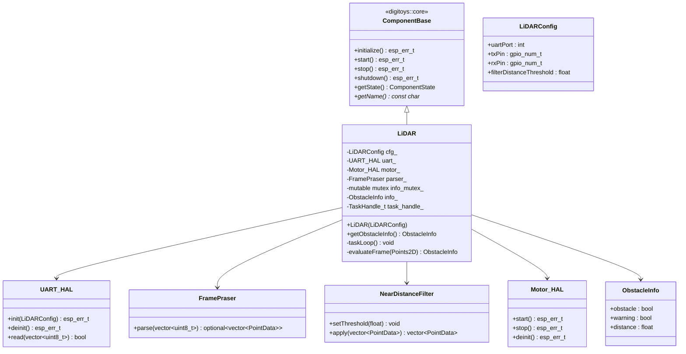

# 🟢 Component: lidar-driver

This component is responsible for reading, parsing, filtering, and managing LiDAR scan data. It handles UART configuration, frame parsing from the LiDAR's binary protocol, and filtering of noisy or too-close readings.

## Basic blocks

### `LiDAR`
- Central class coordinating:
  - UART setup and data reception via `UART_HAL`
  - Frame parsing via `FramePraser`
  - Point filtering via `NearDistanceFilter`
  - LiDAR motor control via `Motor_HAL`
- Public API includes methods to:
  - Initialize sensor
  - Fetch latest points
  - Apply filtering logic

### `FramePraser`
- Parses raw byte stream from LiDAR
- Protocol structure:
  - Header: `0x54 0x2C`
  - 12 points per frame
  - Each point: distance, angle, confidence
- Validates checksum before frame acceptance

### `NearDistanceFilter`
- Filters out points below a configurable threshold
- Used for ignoring close noise or irrelevant objects
- Helps in reducing false positives for braking

### `UART_HAL`
- Encapsulates UART initialization and RX handling
- Uses ESP-IDF ring buffer for non-blocking reads
- Exposes `read()` method returning raw frame data

### `Motor_HAL`
- Controls GPIO line powering the LiDAR motor
- Simple API: `start()` and `stop()`
- Used by `LiDAR` during setup/teardown

### `LiDARConfig`
- Struct containing:
  - UART port ID
  - Pin configuration
  - Filtering threshold
  - Optional debug settings


## Class Diagram



---

## Public API

### `LiDAR::LiDAR(const LiDARConfig& cfg)`

**Description:**  
Creates a LiDAR component with the specified configuration. Inherits from `ComponentBase` for standardized lifecycle management and registers with the centralized logging system.

**Parameters:**  
- `LiDARConfig& cfg`: UART pins, port number, and filtering threshold

**Example:**
```cpp
LiDARConfig cfg = {
    .uartPort = UART_NUM_1,
    .txPin = GPIO_NUM_17,
    .rxPin = GPIO_NUM_16,
    .filterDistanceThreshold = 0.1f
};
LiDAR lidar(cfg);
```

---

### `LiDAR::initialize()`

**Description:**  
Initializes the LiDAR component (ComponentBase interface). Sets up UART and motor hardware.

**Returns:**  
- `ESP_OK` on success, error code otherwise

---

### `LiDAR::start()`

**Description:**  
Starts the LiDAR motor and creates the processing task. Sets component state to RUNNING.

**Returns:**  
- `ESP_OK` on success, error code otherwise

---

### `LiDAR::stop()`

**Description:**  
Stops the LiDAR task and motor. Sets component state to STOPPED.

**Returns:**  
- `ESP_OK` on success, error code otherwise

---

### `LiDAR::shutdown()`

**Description:**  
Completely shuts down the LiDAR component and deinitializes hardware.

**Returns:**  
- `ESP_OK` on success, error code otherwise

---

### `LiDAR::getObstacleInfo()`

**Description:**  
Returns the latest obstacle detection information from LiDAR processing.

**Returns:**  
- `ObstacleInfo` struct containing:
  - `obstacle`: Emergency brake required (bool)
  - `warning`: Progressive slowdown required (bool)  
  - `distance`: Distance to closest obstacle (float, meters)

**Example:**
```cpp
auto info = lidar.getObstacleInfo();
if (info.obstacle) {
    // Apply emergency brake
} else if (info.warning) {
    // Apply gradual slowdown
}
```

**Returns:**  
- `void`

**Example:**
```cpp
LiDAR lidar;
LiDARConfig cfg{UART_NUM_1, GPIO_NUM_17, GPIO_NUM_16, 0.1f};
lidar.init(cfg);
```


### `UART_HAL::init(const LiDARConfig&)`

**Description:**  
Configures the ESP32 UART peripheral and starts internal ring buffer.

**Returns:**  
- `esp_err_t`

---

### `UART_HAL::read(std::vector<uint8_t>& out)`

**Description:**  
Reads available bytes from the UART buffer into a vector.

**Returns:**  
- `bool` – true if full frame read

---

### `FramePraser::parse(const std::vector<uint8_t>&)`

**Description:**  
Parses raw UART bytes into a frame of 12 LiDAR points.

**Returns:**  
- `std::optional<std::vector<PointData>>`

---

### `NearDistanceFilter::setThreshold(float distance_m)`

**Description:**  
Sets the minimum distance threshold for filtering.

---

### `NearDistanceFilter::apply(const std::vector<PointData>&)`

**Returns:**  
- A filtered vector of points above the threshold

---

### `Motor_HAL::start()` / `stop()`

**Description:**  
Controls the LiDAR motor’s power.
