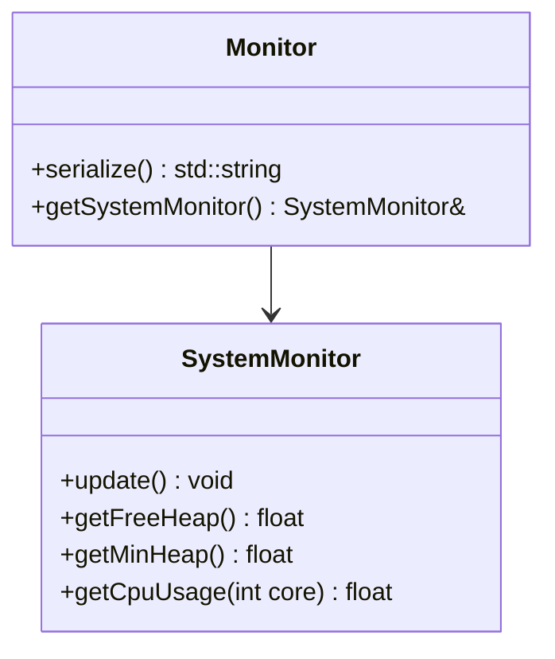

# 🔵 Component: monitor

This component monitors system metrics such as heap usage, task runtime statistics, and CPU load. It is intended for diagnostics, debugging, and visualization via web dashboards or serial outputs.

## Basic blocks

### `SystemMonitor`
- Queries FreeRTOS APIs to extract:
  - Heap usage (free, min, total)
  - CPU usage (per core)
  - Active tasks and their runtime stats
- Stores info in structured internal format

### `Monitor`
- Consumes `SystemMonitor` and serializes data as JSON
- Intended for:
  - Wi-Fi web dashboard
  - Debug and diagnostics over HTTP/serial
- May support filters (e.g., JSON modes or stats only)

## Class Diagram



---

## Public API

### `SystemMonitor::update()`

**Description:**  
Refreshes all internal metrics from FreeRTOS:
- Free heap
- Minimum heap watermark
- Task statistics
- CPU usage per core

---

### `SystemMonitor::getFreeHeap()`

**Returns:**  
- Available heap in bytes as `float`

---

### `SystemMonitor::getMinHeap()`

**Returns:**  
- Minimum ever recorded free heap (watermark)

---

### `SystemMonitor::getCpuUsage(int core)`

**Description:**  
Returns CPU usage for given core (typically `0` or `1`)

**Parameters:**  
- `core`: Core index

---

### `Monitor::serialize()`

**Description:**  
Serializes the most recent stats snapshot as JSON string.

**Returns:**  
- `std::string` – JSON-formatted diagnostics

**Example:**
```cpp
Monitor mon;
std::string json = mon.serialize();  // e.g., send to dashboard
```

---

### `Monitor::getSystemMonitor()`

**Returns:**  
- Reference to `SystemMonitor` instance for direct querying

---
