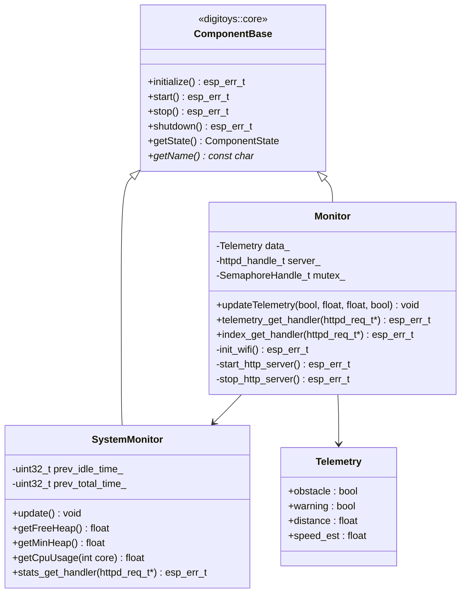

# 🔵 Component: monitor

This component monitors system metrics such as heap usage, task runtime statistics, and CPU load. It is intended for diagnostics, debugging, and visualization via web dashboards or serial outputs.

## Basic blocks

### `SystemMonitor`
- Queries FreeRTOS APIs to extract:
  - Heap usage (free, min, total)
  - CPU usage (per core)
  - Active tasks and their runtime stats
- Stores info in structured internal format

### `Monitor`
- Manages system telemetry and web dashboard
- Intended for:
  - Wi-Fi web dashboard with real-time updates
  - Debug and diagnostics over HTTP/serial
- Provides JSON endpoints for telemetry data

## Class Diagram

---

## Public API

### `Monitor::Monitor()`

**Description:**  
Creates a Monitor component. Inherits from `ComponentBase` for standardized lifecycle management and registers with the centralized logging system.

---

### `Monitor::initialize()`

**Description:**  
Initializes the Monitor component (ComponentBase interface). Creates mutex for telemetry data protection.

**Returns:**  
- `ESP_OK` on success, error code on mutex creation failure

---

### `Monitor::start()`

**Description:**  
Starts the Monitor component including WiFi and HTTP server. Sets component state to RUNNING.

**Returns:**  
- `ESP_OK` on success, error code on WiFi/HTTP server failure

---

### `Monitor::stop()`

**Description:**  
Stops the Monitor component and HTTP server. Sets component state to STOPPED.

**Returns:**  
- `ESP_OK` on success, error code otherwise

---

### `Monitor::shutdown()`

**Description:**  
Completely shuts down the Monitor component. Sets component state to UNINITIALIZED.

**Returns:**  
- `ESP_OK` on success, error code otherwise

---

### `Monitor::updateTelemetry(bool obstacle, float distance, float speed_est, bool warning)`

**Description:**  
Updates telemetry data with current system state information.

**Parameters:**  
- `obstacle`: Emergency brake state
- `distance`: Current obstacle distance
- `speed_est`: Estimated vehicle speed
- `warning`: Progressive slowdown state

---

### `SystemMonitor::SystemMonitor()`

**Description:**  
Creates a SystemMonitor component. Inherits from `ComponentBase` and registers with centralized logging.

---

### `SystemMonitor::initialize()`

**Description:**  
Initializes the SystemMonitor component (ComponentBase interface).

**Returns:**  
- `ESP_OK` on success, error code otherwise

---

### `SystemMonitor::start()`

**Description:**  
Starts the SystemMonitor component. Sets component state to RUNNING.

**Returns:**  
- `ESP_OK` on success, error code otherwise

---
