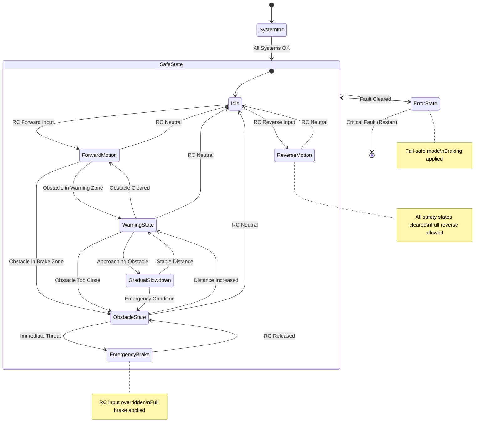
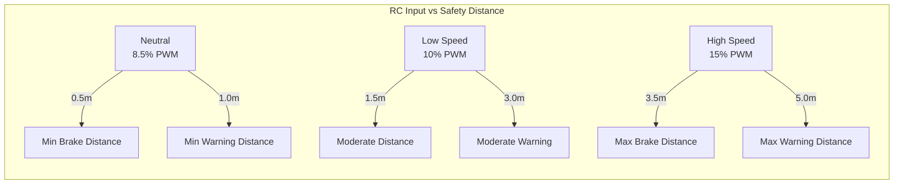
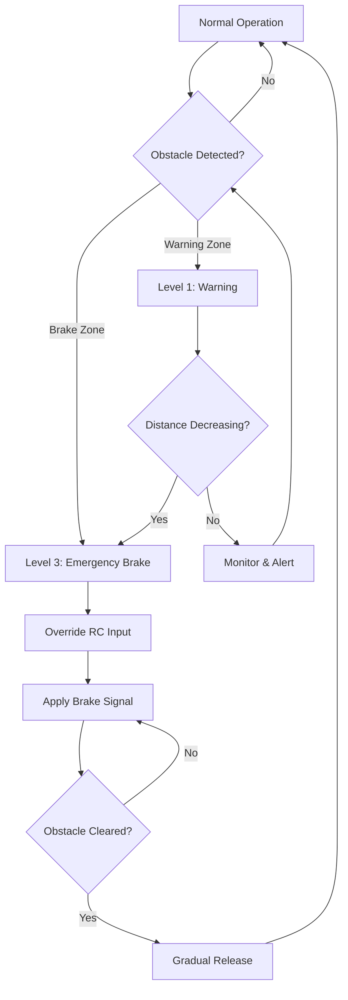

# 🛡️ Safety and Control Logic

This document provides comprehensive documentation of the safety mechanisms, control algorithms, and fail-safe behaviors implemented in the DigiToys firmware. Understanding these systems is crucial for safe operation and further development.

## 🎯 Safety Philosophy

The DigiToys firmware implements a **defense-in-depth** safety approach:

1. **Hardware Level**: Fail-safe signal defaults and hardware watchdogs
2. **Driver Level**: Input validation and signal conditioning  
3. **Application Level**: Multi-layered safety logic with dynamic thresholds
4. **System Level**: Monitoring, error recovery, and graceful degradation

### Core Safety Principles

**🚫 Fail-Safe Operation**
- Default PWM output is brake position (6% duty cycle)
- Loss of control signal results in immediate braking
- System errors trigger emergency stop procedures

**⚡ Real-Time Response**  
- Control loop operates at 20Hz with <5ms jitter tolerance
- Brake response guaranteed within 100ms of obstacle detection
- Interrupt-driven input processing for minimal latency

**🔍 Defensive Programming**
- All inputs validated before use
- State consistency checks at each control cycle
- Graceful handling of invalid or missing sensor data

**📊 Observable Behavior**
- All control decisions logged with diagnostic information
- Real-time telemetry for system monitoring
- Historical data available for safety analysis

## 🎛️ Control System Architecture

### State Machine Overview

The control system implements a hierarchical state machine with clear safety boundaries:



### Safety States Description

**🟢 Idle State**
- Vehicle at rest or RC in neutral position
- All safety monitoring active but no intervention
- Ready to transition to any operational state

**🟡 Forward Motion State**  
- Normal forward operation with RC passthrough
- Continuous obstacle monitoring
- Dynamic threshold calculation based on speed

**🟠 Warning State**
- Obstacle detected within warning distance
- Progressive intervention initiated
- Driver awareness alerts via telemetry

**🔴 Obstacle State**
- Obstacle within braking distance
- RC input overridden with brake signal
- Emergency response protocols active

**⚫ Emergency Brake State**
- Immediate threat detected
- Full brake applied regardless of RC input
- Manual intervention required to clear

**🔵 Reverse Motion State**
- All forward safety states immediately cleared
- Full reverse motion allowed without restrictions
- Safety monitoring continues but does not intervene

## 🧮 Dynamic Threshold Algorithms

### Speed-Dependent Safety Distances

The control system calculates dynamic braking and warning distances based on current vehicle speed:

```cpp
float ObstacleDetector::calculateBrakeDistance(float rc_input) {
    // Convert RC input to speed factor (0.0 = neutral, 1.0 = full throttle)
    float speed_factor = std::max(0.0f, (rc_input - ZERO_SPEED) / (1.0f - ZERO_SPEED));
    
    // Calculate dynamic brake distance with speed-dependent scaling
    float brake_distance = MIN_BRAKE_DISTANCE + 
                          (MAX_BRAKE_DISTANCE - MIN_BRAKE_DISTANCE) * speed_factor;
                          
    // Apply safety margin for high-speed operation
    if (speed_factor > HIGH_SPEED_THRESHOLD) {
        brake_distance *= HIGH_SPEED_MULTIPLIER;
    }
    
    return std::clamp(brake_distance, MIN_BRAKE_DISTANCE, MAX_BRAKE_DISTANCE);
}
```

**Threshold Characteristics:**


### Algorithm Parameters

**Distance Ranges:**
```cpp
// Brake distance calculation
static constexpr float MIN_BRAKE_DISTANCE = 0.5f;    // Minimum safety distance
static constexpr float MAX_BRAKE_DISTANCE = 3.5f;    // Maximum braking distance
static constexpr float HIGH_SPEED_THRESHOLD = 0.7f;  // 70% throttle threshold
static constexpr float HIGH_SPEED_MULTIPLIER = 1.2f; // 20% safety margin

// Warning distance calculation  
static constexpr float MIN_WARNING_DISTANCE = 1.0f;  // Minimum warning distance
static constexpr float MAX_WARNING_DISTANCE = 5.0f;  // Maximum warning distance
static constexpr float WARNING_SCALE_FACTOR = 1.8f;  // Warning/brake ratio
```

**Speed Classification:**
```cpp
enum class SpeedLevel {
    STATIONARY,    // RC input ≤ neutral + tolerance
    LOW_SPEED,     // neutral < input ≤ neutral + 2%  
    MEDIUM_SPEED,  // neutral + 2% < input ≤ neutral + 5%
    HIGH_SPEED,    // input > neutral + 5%
    MAXIMUM_SPEED  // input > neutral + 8%
};
```

## 🎚️ Control Actions and Interventions

### Progressive Intervention Strategy

The control system implements escalating levels of intervention:



### Intervention Levels

**Level 1: Warning State**
```cpp
// Warning intervention - no direct control override
void handleWarningState() {
    // Update telemetry with warning status
    updateTelemetryWarning(true, obstacle_distance);
    
    // Log warning condition
    DIGITOYS_LOGW("ControlTask", "Warning: Obstacle at %.2fm, speed factor %.2f", 
             obstacle_distance, current_speed_factor);
    
    // Continue RC passthrough with monitoring
    // No direct intervention yet
}
```

**Level 2: Gradual Slowdown** 
```cpp
// Progressive speed reduction while maintaining some forward motion
SpeedController::Action handleGradualSlowdown(ControlState& state) {
    float target_duty = calculateSlowdownDuty(state.getLastDistance());
    
    // Gradually reduce speed while maintaining control
    state.setSlowdownDuty(target_duty);
    
    return Action::GRADUAL_SLOWDOWN;
}
```

**Level 3: Emergency Brake**
```cpp
// Full brake override - highest intervention level
void executeEmergencyBrake(PwmDriver& driver) {
    // Override RC input completely
    ESP_ERROR_CHECK(driver.pausePassthrough(0));
    
    // Apply full brake signal
    driver.setDuty(0, ControlConstants::BRAKE);
    
    // Log emergency action
    DIGITOYS_LOGE("ControlTask", "EMERGENCY BRAKE APPLIED");
}
```

### Brake Release Protocol

**Controlled Release Strategy:**
```cpp
SpeedController::Action handleBrakeRelease(ControlState& state, float current_distance) {
    // Check if it's safe to release brake
    if (current_distance > (brake_distance * RELEASE_MARGIN)) {
        
        // Gradual transition back to RC control
        if (state.getSlowdownDuty() > ControlConstants::ZERO_SPEED) {
            // Gradually increase allowed speed
            float new_duty = state.getSlowdownDuty() + ControlConstants::DUTY_STEP;
            state.setSlowdownDuty(std::min(new_duty, current_rc_input));
            return Action::GRADUAL_SLOWDOWN;
        } else {
            // Full release back to RC control
            return Action::RESUME_PASSTHROUGH;
        }
    }
    
    // Not yet safe to release
    return Action::MAINTAIN_SPEED;
}
```

## 🔍 Input Validation and Filtering

### RC Input Validation

**Signal Range Validation:**
```cpp
bool RCInputProcessor::validateRCInput(float duty_cycle) {
    // Check for valid PWM range (typical RC: 1000-2000μs = 5-10% duty)
    if (duty_cycle < MIN_VALID_DUTY || duty_cycle > MAX_VALID_DUTY) {
        DIGITOYS_LOGW("ControlTask", "RC input out of range: %.3f", duty_cycle);
        return false;
    }
    
    // Check for signal timeout
    uint32_t current_time = esp_timer_get_time() / 1000;
    if (current_time - last_valid_input_time_ > RC_TIMEOUT_MS) {
        DIGITOYS_LOGW("ControlTask", "RC input timeout: %lums", current_time - last_valid_input_time_);
        return false;
    }
    
    return true;
}
```

**Signal Conditioning:**
```cpp
float RCInputProcessor::conditionRCInput(float raw_duty) {
    // Apply dead zone around neutral
    if (std::abs(raw_duty - ControlConstants::ZERO_SPEED) < DEAD_ZONE_TOLERANCE) {
        return ControlConstants::ZERO_SPEED;
    }
    
    // Apply input filtering for noise reduction
    filtered_input_ = FILTER_ALPHA * raw_duty + (1.0f - FILTER_ALPHA) * filtered_input_;
    
    // Clamp to safe operating range
    return std::clamp(filtered_input_, MIN_SAFE_DUTY, MAX_SAFE_DUTY);
}
```

### LiDAR Data Validation

**Distance Measurement Validation:**
```cpp
bool LiDAR::validateObstacleData(const ObstacleInfo& info) {
    // Check for infinite or NaN distances
    if (!std::isfinite(info.distance)) {
        DIGITOYS_LOGD("LiDAR", "Invalid distance reading: %.2f", info.distance);
        return false;
    }
    
    // Check for reasonable distance range
    if (info.distance < MIN_SENSOR_RANGE || info.distance > MAX_SENSOR_RANGE) {
        DIGITOYS_LOGD("LiDAR", "Distance out of sensor range: %.2fm", info.distance);
        return false;
    }
    
    // Check confidence level
    if (info.confidence < MIN_CONFIDENCE_THRESHOLD) {
        DIGITOYS_LOGD("LiDAR", "Low confidence reading: %d", info.confidence);
        return false;
    }
    
    return true;
}
```

**Angle Sector Filtering:**
```cpp
bool LiDAR::isInDetectionSector(float angle_deg) {
    // Handle wrap-around sectors (e.g., 350° to 10°)
    if (config_.angleMinDeg > config_.angleMaxDeg) {
        return (angle_deg >= config_.angleMinDeg) || (angle_deg <= config_.angleMaxDeg);
    } else {
        return (angle_deg >= config_.angleMinDeg) && (angle_deg <= config_.angleMaxDeg);
    }
}
```

## 🚨 Error Handling and Recovery

### Fault Detection

**System Health Monitoring:**
```cpp
class SystemHealthMonitor {
public:
    enum class HealthStatus {
        HEALTHY,
        DEGRADED, 
        CRITICAL,
        FAILED
    };
    
    struct HealthMetrics {
        bool lidar_responsive;
        bool rc_input_valid;
        bool control_loop_timing;
        uint32_t memory_usage;
        float cpu_utilization;
    };
    
    HealthStatus evaluateSystemHealth(const HealthMetrics& metrics);
};
```

**Fault Types and Responses:**

| Fault Type | Detection | Response | Recovery |
|------------|-----------|----------|----------|
| **LiDAR Timeout** | No data >500ms | Maintain last safe state | Auto-retry, degraded mode |
| **RC Signal Loss** | No PWM >200ms | Emergency brake | Manual reset required |
| **Control Loop Delay** | Period >55ms | Log warning | Auto-recovery |
| **Memory Exhaustion** | Heap <20KB | Restart system | Full system reset |
| **Stack Overflow** | FreeRTOS hook | Immediate restart | Investigation required |

### Graceful Degradation

**Sensor Failure Handling:**
```cpp
ControlAction handleSensorFailure(SensorType failed_sensor) {
    switch (failed_sensor) {
        case SensorType::LIDAR:
            // Continue with last known safe distance
            DIGITOYS_LOGW("ControlTask", "LiDAR failed - using last known distance");
            return ControlAction::MAINTAIN_LAST_SAFE_STATE;
            
        case SensorType::RC_INPUT:
            // Immediate stop for safety
            DIGITOYS_LOGE("ControlTask", "RC input failed - emergency stop");
            return ControlAction::EMERGENCY_STOP;
            
        default:
            return ControlAction::CONTINUE_MONITORING;
    }
}
```

**Degraded Operation Modes:**
```cpp
enum class OperationMode {
    NORMAL,           // All systems operational
    LIDAR_DEGRADED,   // Using last valid LiDAR data
    MANUAL_ONLY,      // Safety systems disabled, RC passthrough only
    EMERGENCY_STOP    // All control disabled, brake applied
};
```

## 📊 Safety Verification

### Test Scenarios

**Functional Safety Tests:**
1. **Obstacle Detection Response**
   - Place obstacle at various distances
   - Verify appropriate intervention level
   - Measure response time <100ms

2. **Signal Loss Handling**
   - Disconnect RC input during operation
   - Verify immediate emergency brake
   - Test recovery procedures

3. **Sensor Failure Simulation**
   - Block LiDAR sensor
   - Verify graceful degradation
   - Test manual override capability

4. **Edge Case Handling**
   - Test rapid obstacle appearance/disappearance
   - Verify state transition stability
   - Test extreme RC input values

### Safety Metrics

**Key Performance Indicators:**
```cpp
struct SafetyMetrics {
    uint32_t total_brake_events;
    uint32_t false_positive_rate;     // Unnecessary brakes per hour
    uint32_t false_negative_rate;     // Missed obstacles per hour
    float average_response_time_ms;
    uint32_t system_uptime_hours;
    uint32_t fault_recovery_count;
};
```

**Acceptable Performance Ranges:**
- **False Positive Rate**: <5 events per hour normal operation
- **False Negative Rate**: 0 events (absolute requirement)
- **Response Time**: <100ms (95th percentile)
- **System Availability**: >99.9% uptime
- **Recovery Success**: >95% automatic fault recovery

### Compliance Considerations

**Safety Standards Alignment:**
- **ISO 26262**: Automotive functional safety principles
- **IEC 61508**: Functional safety for safety-critical systems
- **DO-178C**: Software considerations for airborne systems (adapted principles)

**Documentation Requirements:**
- Hazard analysis and risk assessment
- Safety requirements specification
- Verification and validation results
- Failure mode and effects analysis (FMEA)

---

This safety and control logic documentation ensures the DigiToys firmware maintains the highest standards of safety for autonomous vehicle control applications.
