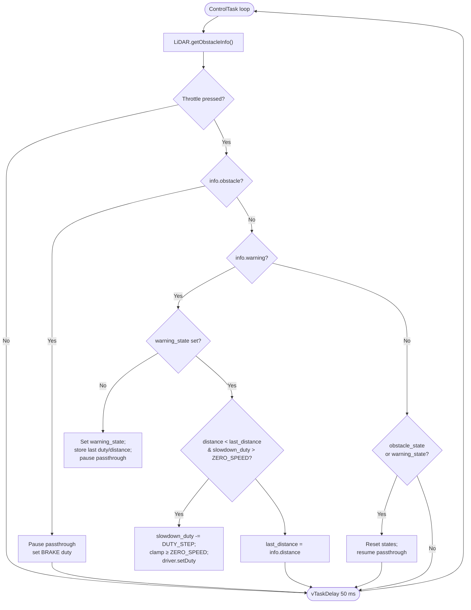

# Slowdown algo

The slowdown logic is implemented inside `ControlTask` in **main/main.cpp**. The code sets up local state (`obstacle_state`, `warning_state`, `last_distance`, and `slowdown_duty`) and defines constants for throttle control (`BRAKE`, `ZERO_SPEED`, and `DUTY_STEP`)

During each iteration of the control loop:

1. Fetch LiDAR data: `auto info = lidar.getObstacleInfo();`

2. Check if throttle is engaged: `if (driver.isThrottlePressed(0))`

    * Obstacle detected:

        * Apply full brake once per event by pausing passthrough and setting duty to `BRAKE` (≈6 %)

    * Warning zone:

        * If entering warning for the first time, store the current duty/distance and pause passthrough

        * On subsequent iterations, if the car is still approaching (info.distance < last_distance) and the duty is above neutral, decrease the duty gradually by DUTY_STEP until it reaches ZERO_SPEED (≈9 %)

    * No obstacle or warning:

        * If braking/slowdown was active, resume passthrough and clear the state flags

3. Delay: The loop sleeps for 50 ms before checking again

The helper `isThrottlePressed` method is provided by `PwmDriver` and checks whether the recorded throttle duty is outside the neutral band (default center 9 %, ±0.5 %)

